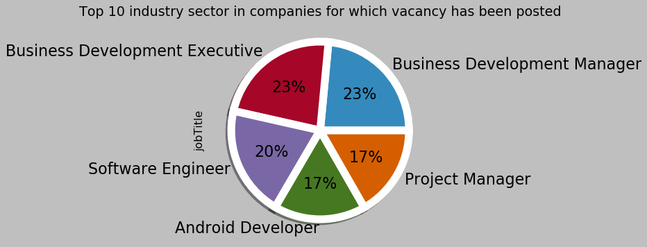

```python
from pyspark.sql import SparkSession
from pyspark.sql.functions import *

import pandas as pd
import numpy as np
import matplotlib.pyplot as plt
import seaborn as sns
```


```python
# Create Spark Session

spark = SparkSession.builder.appName('basics').getOrCreate()

sqlContext.setConf("spark.sql.parquet.compression.codec", "snappy")
```


```python
# Creating schema for table1
from pyspark.sql.types import (StructField,StructType,StringType,IntegerType,FloatType,LongType)

data_schema = [ StructField('jobTitle',StringType(),True),
                StructField('numberOfPositions',IntegerType(),True),
                StructField('payRate',StringType(),True),
                StructField('postDate',StringType(),True),
                StructField('siteName',StringType(),True),
                StructField('skills',StringType(),True),
                StructField('uniqueId',StringType(),True)
             
]

final_struc = StructType(fields=data_schema)
```


```python
# Reading table 1 from MySql Database
table1 = spark.read.format("jdbc").option("url", "jdbc:mysql://localhost/naukridatabase").option("driver","com.mysql.jdbc.Driver").option("dbtable", "otherdescription").option("user", "root").option("password", "").option("schema",final_struc).option("partition",4).load()
```


```python
# persisting table in memory for performing furture operations
table1 = table1.persist()
```


```python
table1.show(2)
```

    +--------------------+-----------------+--------------------+--------------------+--------+---------+--------------------+
    |            jobTitle|numberOfPositions|             payRate|            postDate|siteName|   skills|            uniqueId|
    +--------------------+-----------------+--------------------+--------------------+--------+---------+--------------------+
    |Advertising Execu...|                0|Not Disclosed by ...|2015-12-29 02:24:...|        |Marketing|0000ac8099283dd54...|
    |Required MBA Fres...|               20|1,25,000 - 2,00,0...|2016-05-03 11:35:...|        |         |0001932463014f38e...|
    +--------------------+-----------------+--------------------+--------------------+--------+---------+--------------------+
    only showing top 2 rows
    
    


```python
# We need to convert the blank values to null to fill them after that
table1 = table1.withColumn('jobTitle', when(col('jobTitle') == '', None).otherwise(col('jobTitle')))
table1 = table1.withColumn('numberOfPositions', when(col('numberOfPositions') == '', None).otherwise(col('numberOfPositions')))
table1 = table1.withColumn('payRate', when(col('payRate') == '', None).otherwise(col('payRate')))
table1 = table1.withColumn('postDate', when(col('postDate') == '', None).otherwise(col('postDate')))
table1 = table1.withColumn('siteName', when(col('siteName') == '', None).otherwise(col('siteName')))
table1 = table1.withColumn('skills', when(col('skills') == '', None).otherwise(col('skills')))
```


```python
# checking if any Null/Nan still exists
table1.select([count(when(isnull(c), c)).alias(c) for c in table1.columns]).show()
```

    +--------+-----------------+-------+--------+--------+------+---------+
    |jobTitle|numberOfPositions|payRate|postDate|siteName|skills|uniqueId2|
    +--------+-----------------+-------+--------+--------+------+---------+
    |       0|                0|     97|      24|   18012|   528|        0|
    +--------+-----------------+-------+--------+--------+------+---------+
    
    


```python
# Mysql has automatically converted integer column null to 0. But numberOfPositions can't be 0 replacing that with 1 
table1 = table1.replace(0,1,"numberOfPositions")
```


```python
table1 = table1.withColumnRenamed('uniqueId','uniqueId2')
```


```python

# --- Replacing value in rows(Can be done using when-then or replace)
#table1.replace(["M", "F"], ["0", "1"], "gender")

# --- Casting datatype( can be done using round().cast() or this way)
#user_gender.select("userId", user_gender.gender.cast("int"))

# -- Aggregation and changing name (can be done using alias or withColumnRenamed)
#user_NumofSongs = df_withchurn.filter(df_withchurn.page=="NextSong").dropDuplicates().groupby("userId").count()
#user_NumofSongs = user_NumofSongs.withColumnRenamed("count", "NumofSongs").sort('userId')
```


```python
# replacing all the null values by 1 and unknown
table1 = table1.na.fill({'jobTitle':'unknown','numberOfPositions': 1,'payRate':'as per industry standards','postDate':'unknown','siteName': 'unknown','skills':'unknown'})
table1 = table1.filter(table1['postDate'] !='unknown')
```


```python
table1.groupBy('siteName').count().show()
```

    +--------------+-----+
    |      siteName|count|
    +--------------+-----+
    |       unknown|17991|
    |www.naukri.com| 3985|
    +--------------+-----+
    
    


```python
# replace siteName column value with www.naukri.com
table1 = table1.replace('unknown','www.naukri.com',"siteName")
```


```python
# seeing the structure of table
table1.printSchema()
```

    root
     |-- jobTitle: string (nullable = false)
     |-- numberOfPositions: integer (nullable = false)
     |-- payRate: string (nullable = false)
     |-- postDate: string (nullable = false)
     |-- siteName: string (nullable = false)
     |-- skills: string (nullable = false)
     |-- uniqueId2: string (nullable = true)
    
    


```python
# checking if any Null/Nan still exists
table1.select([count(when(isnull(c), c)).alias(c) for c in table1.columns]).show()
```

    +--------+-----------------+-------+--------+--------+------+---------+
    |jobTitle|numberOfPositions|payRate|postDate|siteName|skills|uniqueId2|
    +--------+-----------------+-------+--------+--------+------+---------+
    |       0|                0|      0|       0|       0|     0|        0|
    +--------+-----------------+-------+--------+--------+------+---------+
    
    


```python
table1 = table1.dropDuplicates()
```


```python
# final clearned and structured table 
table1.toPandas().head(5)
```


<div>
<style scoped>
    .dataframe tbody tr th:only-of-type {
        vertical-align: middle;
    }

    .dataframe tbody tr th {
        vertical-align: top;
    }

    .dataframe thead th {
        text-align: right;
    }
</style>
<table border="1" class="dataframe">
  <thead>
    <tr style="text-align: right;">
      <th></th>
      <th>jobTitle</th>
      <th>numberOfPositions</th>
      <th>payRate</th>
      <th>postDate</th>
      <th>siteName</th>
      <th>skills</th>
      <th>uniqueId2</th>
    </tr>
  </thead>
  <tbody>
    <tr>
      <td>0</td>
      <td>Services Project Manager</td>
      <td>1</td>
      <td>Not Disclosed by Recruiter</td>
      <td>2016-03-08 02:30:35 +0000</td>
      <td>www.naukri.com</td>
      <td>IT Software - Other</td>
      <td>00c54a243f85a75a3c310840bf9c8bdb</td>
    </tr>
    <tr>
      <td>1</td>
      <td>TREASURY DEALER</td>
      <td>1</td>
      <td>Not Disclosed by Recruiter</td>
      <td>2016-12-07 10:37:36 +0000</td>
      <td>www.naukri.com</td>
      <td>Financial Services</td>
      <td>012977a7630d3ba29e2f902786135068</td>
    </tr>
    <tr>
      <td>2</td>
      <td>Senior ETL / BI Developer</td>
      <td>1</td>
      <td>Not Disclosed by Recruiter</td>
      <td>2016-03-31 07:23:40 +0000</td>
      <td>www.naukri.com</td>
      <td>IT Software - Application Programming</td>
      <td>04d969c7de5663e56a3ace0103588c70</td>
    </tr>
    <tr>
      <td>3</td>
      <td>Sr. Executive/Asst. manager - QC Metrology</td>
      <td>1</td>
      <td>Not Disclosed by Recruiter</td>
      <td>2015-12-29 02:23:51 +0000</td>
      <td>www.naukri.com</td>
      <td>Production</td>
      <td>04df3247d92f86e194e662e6db2cec5a</td>
    </tr>
    <tr>
      <td>4</td>
      <td>iOS Developer</td>
      <td>1</td>
      <td>Not Disclosed by Recruiter</td>
      <td>2016-08-06 18:44:10 +0000</td>
      <td>www.naukri.com</td>
      <td>IT Software - Application Programming</td>
      <td>05f4f37b6b2cb61ec199a00d25da5ea7</td>
    </tr>
  </tbody>
</table>
</div>


```python
#storing table in compressed parquet format with snappy compression
table1.write.parquet("C:/jobPortalTables/table1/otherDescption/",partitionBy='skills',compression='snappy')
```


```python
# Creating schema for table2
from pyspark.sql.types import (StructField,StructType,StringType,IntegerType,LongType,LongType)

data_schema2 = [ StructField('company',StringType(),True),
                StructField('education',StringType(),True),
                StructField('experience',StringType(),True),
                StructField('industry',StringType(),True),
                StructField('jobDescription',StringType(),True),
                StructField('jobId',LongType(),True),
                StructField('jobLocation',StringType(),True),
                StructField('uniqueId',StringType(),True)
             
]

final_struc2 = StructType(fields=data_schema)
```


```python
# Reading table 2 from MySql Database
table2 = spark.read.format("jdbc").option("url", "jdbc:mysql://localhost/naukridatabase").option("driver","com.mysql.jdbc.Driver").option("dbtable", "jobdescription").option("user", "root").option("password", "").option("schema",final_struc2).option("partition",4).load()
```


```python
# Persisting table in memory for performing furture operations
table2 = table2.persist()
```


```python
table2.show(2)
```

    +--------------------+--------------------+----------+--------------------+--------------------+-----------+-----------+--------------------+
    |             company|           education|experience|            industry|      jobDescription|      jobId|jobLocation|            uniqueId|
    +--------------------+--------------------+----------+--------------------+--------------------+-----------+-----------+--------------------+
    |        Confidential|UG: Any Graduate ...| 3 - 6 yrs|IT-Software / Sof...|Job Description ¬...|60916900046|  Bengaluru|7091560c1ce6ca67c...|
    |Anlage Infotech (...|                null|5 - 10 yrs|IT-Software / Sof...|Job Description ¬...|90816007790|  Bengaluru|af227267794bc8a13...|
    +--------------------+--------------------+----------+--------------------+--------------------+-----------+-----------+--------------------+
    only showing top 2 rows
    
    


```python
# We need to convert the blank values to null to fill them after that
table2 = table2.withColumn('company', when(col('company') == '', None).otherwise(col('company')))
table2 = table2.withColumn('education', when(col('education') == '', None).otherwise(col('education')))
table2 = table2.withColumn('experience', when(col('experience') == '', None).otherwise(col('experience')))
table2 = table2.withColumn('industry', when(col('industry') == '', None).otherwise(col('industry')))
table2 = table2.withColumn('jobDescription', when(col('jobDescription') == '', None).otherwise(col('jobDescription')))
table2 = table2.withColumn('jobLocation', when(col('jobLocation') == '', None).otherwise(col('jobLocation')))
```


```python
# checking if any Null/Nan still exists
table2.select([count(when(isnull(c), c)).alias(c) for c in table2.columns]).show()
```

    +-------+---------+----------+--------+--------------+-----+-----------+--------+
    |company|education|experience|industry|jobDescription|jobId|jobLocation|uniqueId|
    +-------+---------+----------+--------+--------------+-----+-----------+--------+
    |      4|     1995|         4|       5|             4|    0|        497|       1|
    +-------+---------+----------+--------+--------------+-----+-----------+--------+
    
    


```python
# replacing all the null values by 1 and unknown
table2 = table2.na.fill({'company':'unknown','education':'unknown','experience':' 0 - 1 yrs','industry':'unknown','jobDescription': 'unknown','jobLocation':'unknown','uniqueId':'unknown'})
```


```python
# checking if any Null/Nan still exists
table2.select([count(when(isnull(c), c)).alias(c) for c in table2.columns]).show()
```

    +-------+---------+----------+--------+--------------+-----+-----------+--------+
    |company|education|experience|industry|jobDescription|jobId|jobLocation|uniqueId|
    +-------+---------+----------+--------+--------------+-----+-----------+--------+
    |      0|        0|         0|       0|             0|    0|          0|       0|
    +-------+---------+----------+--------+--------------+-----+-----------+--------+
    
    


```python
table2 =table2.dropDuplicates()
```


```python
# final clearned and structured table 
table2.toPandas().head(5)
```


<div>
<style scoped>
    .dataframe tbody tr th:only-of-type {
        vertical-align: middle;
    }

    .dataframe tbody tr th {
        vertical-align: top;
    }

    .dataframe thead th {
        text-align: right;
    }
</style>
<table border="1" class="dataframe">
  <thead>
    <tr style="text-align: right;">
      <th></th>
      <th>company</th>
      <th>education</th>
      <th>experience</th>
      <th>industry</th>
      <th>jobDescription</th>
      <th>jobId</th>
      <th>jobLocation</th>
      <th>uniqueId</th>
    </tr>
  </thead>
  <tbody>
    <tr>
      <td>0</td>
      <td>Madhyam Buildtech Pvt. Ltd.</td>
      <td>UG: Any Graduate - Any Specialization, Graduat...</td>
      <td>1 - 6 yrs</td>
      <td>Real Estate / Property</td>
      <td>Job Description   Send me Jobs like this 1-Re...</td>
      <td>60516000423</td>
      <td>Gurgaon</td>
      <td>2cee1d0bc9db18e680bdc1c383556e3d</td>
    </tr>
    <tr>
      <td>1</td>
      <td>ICD Security Solutions</td>
      <td>UG: Any Graduate PG:MBA/PGDM Doctorate:Any Doc...</td>
      <td>10 - 15 yrs</td>
      <td>IT-Hardware &amp; Networking</td>
      <td>Job Description   Send me Jobs like this Main...</td>
      <td>20416502383</td>
      <td>Bengaluru/Bangalore</td>
      <td>560915e69d934e2b4cbe1f075178f0cf</td>
    </tr>
    <tr>
      <td>2</td>
      <td>Careernet Technologies Pvt Ltd hiring for Client</td>
      <td>UG: B.Tech/B.E. - Any Specialization PG:M.Tech...</td>
      <td>9 - 14 yrs</td>
      <td>IT-Software / Software Services</td>
      <td>Job Description   Send me Jobs like this Resp...</td>
      <td>3</td>
      <td>Delhi/NCR(National Capital Region) , Gurgaon ,...</td>
      <td>15008cd731078505b12492b34bffeb52</td>
    </tr>
    <tr>
      <td>3</td>
      <td>Edubridge International School</td>
      <td>UG: Any Graduate PG:Post Graduation Not Requir...</td>
      <td>4 - 6 yrs</td>
      <td>Education / Teaching / Training</td>
      <td>Job Description   Send me Jobs like this Cand...</td>
      <td>70715502210</td>
      <td>Mumbai , Mumbai</td>
      <td>684b5207b13f4dc8cbcb7115497d9250</td>
    </tr>
    <tr>
      <td>4</td>
      <td>PACE Global HR Consulting Services. hiring for...</td>
      <td>unknown</td>
      <td>12 - 15 yrs</td>
      <td>Consumer Electronics / Appliances / Durables</td>
      <td>Job Description   Send me Jobs like this Job ...</td>
      <td>2</td>
      <td>Bengaluru</td>
      <td>bd6a2709d1606be43aca95cd4e3ddd82</td>
    </tr>
  </tbody>
</table>
</div>


```python
# joining 2 tables   
jobTable = table2.join(table1,on= table2.uniqueId == table1.uniqueId2,how='inner')
```


```python
# seeing the physical plan of joining the table  - > Broadcast Join is performeded.
jobTable.explain()
```

    == Physical Plan ==
    *(4) BroadcastHashJoin [uniqueId#4051], [uniqueId2#290], Inner, BuildRight
    :- *(4) HashAggregate(keys=[jobDescription#4049, jobLocation#4050, industry#4048, company#4045, experience#4047, education#4046, jobId#3512L, uniqueId#4051], functions=[])
    :  +- Exchange hashpartitioning(jobDescription#4049, jobLocation#4050, industry#4048, company#4045, experience#4047, education#4046, jobId#3512L, uniqueId#4051, 200)
    :     +- *(1) HashAggregate(keys=[jobDescription#4049, jobLocation#4050, industry#4048, company#4045, experience#4047, education#4046, jobId#3512L, uniqueId#4051], functions=[])
    :        +- *(1) Project [coalesce(CASE WHEN (company#3507 = ) THEN null ELSE company#3507 END, unknown) AS company#4045, coalesce(CASE WHEN (education#3508 = ) THEN null ELSE education#3508 END, unknown) AS education#4046, coalesce(CASE WHEN (experience#3509 = ) THEN null ELSE experience#3509 END,  0 - 1 yrs) AS experience#4047, coalesce(CASE WHEN (industry#3510 = ) THEN null ELSE industry#3510 END, unknown) AS industry#4048, coalesce(CASE WHEN (jobDescription#3511 = ) THEN null ELSE jobDescription#3511 END, unknown) AS jobDescription#4049, jobId#3512L, coalesce(CASE WHEN (jobLocation#3513 = ) THEN null ELSE jobLocation#3513 END, unknown) AS jobLocation#4050, coalesce(uniqueId#3514, unknown) AS uniqueId#4051]
    :           +- InMemoryTableScan [company#3507, education#3508, experience#3509, industry#3510, jobDescription#3511, jobId#3512L, jobLocation#3513, uniqueId#3514]
    :                 +- InMemoryRelation [company#3507, education#3508, experience#3509, industry#3510, jobDescription#3511, jobId#3512L, jobLocation#3513, uniqueId#3514], StorageLevel(disk, memory, 1 replicas)
    :                       +- *(1) Scan JDBCRelation(jobdescription) [numPartitions=1] [company#3507,education#3508,experience#3509,industry#3510,jobDescription#3511,jobId#3512L,jobLocation#3513,uniqueId#3514] PushedFilters: [], ReadSchema: struct<company:string,education:string,experience:string,industry:string,jobDescription:string,jo...
    +- BroadcastExchange HashedRelationBroadcastMode(List(input[6, string, true]))
       +- *(3) HashAggregate(keys=[uniqueId2#290, siteName#1642, payRate#1144, postDate#1145, skills#1147, numberOfPositions#1143, jobTitle#1142], functions=[])
          +- Exchange hashpartitioning(uniqueId2#290, siteName#1642, payRate#1144, postDate#1145, skills#1147, numberOfPositions#1143, jobTitle#1142, 200)
             +- *(2) HashAggregate(keys=[uniqueId2#290, siteName#1642, payRate#1144, postDate#1145, skills#1147, numberOfPositions#1143, jobTitle#1142], functions=[])
                +- *(2) Project [jobTitle#1142, numberOfPositions#1143, payRate#1144, postDate#1145, CASE WHEN (siteName#1146 = unknown) THEN www.naukri.com ELSE siteName#1146 END AS siteName#1642, skills#1147, uniqueId2#290]
                   +- *(2) Filter isnotnull(uniqueId2#290)
                      +- InMemoryTableScan [jobTitle#1142, numberOfPositions#1143, payRate#1144, postDate#1145, siteName#1146, skills#1147, uniqueId2#290], [isnotnull(uniqueId2#290)]
                            +- InMemoryRelation [jobTitle#1142, numberOfPositions#1143, payRate#1144, postDate#1145, siteName#1146, skills#1147, uniqueId2#290], StorageLevel(disk, memory, 1 replicas)
                                  +- *(1) Project [coalesce(CASE WHEN (coalesce(jobTitle#0, unknown) = ) THEN null ELSE coalesce(jobTitle#0, unknown) END, unknown) AS jobTitle#1142, coalesce(CASE WHEN (coalesce(numberOfPositions#1, 1) = 0) THEN 1 ELSE coalesce(numberOfPositions#1, 1) END, 1) AS numberOfPositions#1143, coalesce(CASE WHEN (coalesce(payRate#2, as per industry standards) = ) THEN null ELSE coalesce(payRate#2, as per industry standards) END, as per industry standards) AS payRate#1144, coalesce(CASE WHEN (coalesce(postDate#3, unknown) = ) THEN null ELSE coalesce(postDate#3, unknown) END, unknown) AS postDate#1145, coalesce(CASE WHEN (coalesce(siteName#4, unknown) = ) THEN null ELSE coalesce(siteName#4, unknown) END, unknown) AS siteName#1146, coalesce(CASE WHEN (coalesce(skills#5, unknown) = ) THEN null ELSE coalesce(skills#5, unknown) END, unknown) AS skills#1147, uniqueId#6 AS uniqueId2#290]
                                     +- *(1) Filter (NOT (coalesce(postDate#3, unknown) = unknown) && NOT (coalesce(CASE WHEN (coalesce(postDate#3, unknown) = ) THEN null ELSE coalesce(postDate#3, unknown) END, unknown) = unknown))
                                        +- InMemoryTableScan [jobTitle#0, numberOfPositions#1, payRate#2, postDate#3, siteName#4, skills#5, uniqueId#6], [NOT (coalesce(postDate#3, unknown) = unknown), NOT (coalesce(CASE WHEN (coalesce(postDate#3, unknown) = ) THEN null ELSE coalesce(postDate#3, unknown) END, unknown) = unknown)]
                                              +- InMemoryRelation [jobTitle#0, numberOfPositions#1, payRate#2, postDate#3, siteName#4, skills#5, uniqueId#6], StorageLevel(disk, memory, 1 replicas)
                                                    +- *(1) Scan JDBCRelation(otherdescription) [numPartitions=1] [jobTitle#0,numberOfPositions#1,payRate#2,postDate#3,siteName#4,skills#5,uniqueId#6] PushedFilters: [], ReadSchema: struct<jobTitle:string,numberOfPositions:int,payRate:string,postDate:string,siteName:string,skill...
    


```python
# getting the number of partitions of the dataframe 
jobTable.rdd.getNumPartitions()
```


    200


```python
# seeing the schema of the jobTable
jobTable.printSchema()
```

    root
     |-- company: string (nullable = false)
     |-- education: string (nullable = false)
     |-- experience: string (nullable = false)
     |-- industry: string (nullable = false)
     |-- jobDescription: string (nullable = false)
     |-- jobId: long (nullable = true)
     |-- jobLocation: string (nullable = false)
     |-- uniqueId: string (nullable = false)
     |-- jobTitle: string (nullable = false)
     |-- numberOfPositions: integer (nullable = false)
     |-- payRate: string (nullable = false)
     |-- postDate: string (nullable = false)
     |-- siteName: string (nullable = false)
     |-- skills: string (nullable = false)
     |-- uniqueId2: string (nullable = true)
    
    


```python
# can convert to Pandas as see the table for better look
jobTable.toPandas().head(3)
```


<div>
<style scoped>
    .dataframe tbody tr th:only-of-type {
        vertical-align: middle;
    }

    .dataframe tbody tr th {
        vertical-align: top;
    }

    .dataframe thead th {
        text-align: right;
    }
</style>
<table border="1" class="dataframe">
  <thead>
    <tr style="text-align: right;">
      <th></th>
      <th>company</th>
      <th>education</th>
      <th>experience</th>
      <th>industry</th>
      <th>jobDescription</th>
      <th>jobId</th>
      <th>jobLocation</th>
      <th>uniqueId</th>
      <th>jobTitle</th>
      <th>numberOfPositions</th>
      <th>payRate</th>
      <th>postDate</th>
      <th>siteName</th>
      <th>skills</th>
      <th>uniqueId2</th>
    </tr>
  </thead>
  <tbody>
    <tr>
      <td>0</td>
      <td>Madhyam Buildtech Pvt. Ltd.</td>
      <td>UG: Any Graduate - Any Specialization, Graduat...</td>
      <td>1 - 6 yrs</td>
      <td>Real Estate / Property</td>
      <td>Job Description   Send me Jobs like this 1-Re...</td>
      <td>60516000423</td>
      <td>Gurgaon</td>
      <td>2cee1d0bc9db18e680bdc1c383556e3d</td>
      <td>Walk-in Interviews for Sales-executive/assista...</td>
      <td>1</td>
      <td>1,50,000 - 4,25,000 P.A</td>
      <td>2016-05-06 11:35:10 +0000</td>
      <td>www.naukri.com</td>
      <td>Sales</td>
      <td>2cee1d0bc9db18e680bdc1c383556e3d</td>
    </tr>
    <tr>
      <td>1</td>
      <td>ICD Security Solutions</td>
      <td>UG: Any Graduate PG:MBA/PGDM Doctorate:Any Doc...</td>
      <td>10 - 15 yrs</td>
      <td>IT-Hardware &amp; Networking</td>
      <td>Job Description   Send me Jobs like this Main...</td>
      <td>20416502383</td>
      <td>Bengaluru/Bangalore</td>
      <td>560915e69d934e2b4cbe1f075178f0cf</td>
      <td>Senior Account Manager Sales</td>
      <td>1</td>
      <td>Not Disclosed by Recruiter</td>
      <td>2016-04-02 07:23:47 +0000</td>
      <td>www.naukri.com</td>
      <td>Sales</td>
      <td>560915e69d934e2b4cbe1f075178f0cf</td>
    </tr>
    <tr>
      <td>2</td>
      <td>Careernet Technologies Pvt Ltd hiring for Client</td>
      <td>UG: B.Tech/B.E. - Any Specialization PG:M.Tech...</td>
      <td>9 - 14 yrs</td>
      <td>IT-Software / Software Services</td>
      <td>Job Description   Send me Jobs like this Resp...</td>
      <td>3</td>
      <td>Delhi/NCR(National Capital Region) , Gurgaon ,...</td>
      <td>15008cd731078505b12492b34bffeb52</td>
      <td>Technical Architect for an Ecommerce MNC</td>
      <td>3</td>
      <td>35,00,000 - 50,00,000 &amp; above P.A</td>
      <td>2016-05-20 17:36:05 +0000</td>
      <td>www.naukri.com</td>
      <td>IT Software - Application Programming</td>
      <td>15008cd731078505b12492b34bffeb52</td>
    </tr>
  </tbody>
</table>
</div>


```python
# droping the unwanted columns
jobTable = jobTable.drop('uniqueId','uniqueId2')
```


```python
# registering the table temporary for performing SQL queries on it
jobTable.registerTempTable('jobData')
```


```python
# performing SQL query
spark.sql("select * from jobData limit 2").show()
```


<style scoped>
  .ansiout {
    display: block;
    unicode-bidi: embed;
    white-space: pre-wrap;
    word-wrap: break-word;
    word-break: break-all;
    font-family: "Source Code Pro", "Menlo", monospace;;
    font-size: 13px;
    color: #555;
    margin-left: 4px;
    line-height: 19px;
  }
</style>
<div class="ansiout">+------------------+--------------------+----------+--------------------+--------------------+-------------------+--------------------+-----------------+--------------------+--------------------+---------+---------+
           company|           education|experience|            industry|      jobdescription|joblocation_address|            jobtitle|numberofpositions|             payrate|            postdate|site_name|   skills|
+------------------+--------------------+----------+--------------------+--------------------+-------------------+--------------------+-----------------+--------------------+--------------------+---------+---------+
  MM Media Pvt Ltd|UG: B.Tech/B.E. -...| 0 - 1 yrs|Media / Entertain...|Job Description  ...|            Chennai|Walkin Data Entry...|                1|1,50,000 - 2,25,0...|2016-05-21 19:30:...|  unknown|     ITES|
find live infotech|UG: B.Tech/B.E. -...| 0 - 0 yrs|Advertising / PR ...|Job Description  ...|            Chennai|Work Based Onhome...|               60|1,50,000 - 2,50,0...|2016-05-21 19:30:...|  unknown|Marketing|
+------------------+--------------------+----------+--------------------+--------------------+-------------------+--------------------+-----------------+--------------------+--------------------+---------+---------+

</div>


```python
# Creating new columns minimum experience and maximum experience
split_col = split(jobTable['experience'], ' ')
jobTable = jobTable.withColumn('min_experience', split_col.getItem(0).cast('integer'))
jobTable = jobTable.withColumn('max_experience', split_col.getItem(2).cast('integer'))
```


```python
#filling na values with 1 as min and max experience
jobTable = jobTable.na.fill({'min_experience':1,'max_experience':1})
```


```python
jobTable.where(jobTable["min_experience"].isNull()).toPandas().head(1)
```


<div>
<style scoped>
    .dataframe tbody tr th:only-of-type {
        vertical-align: middle;
    }

    .dataframe tbody tr th {
        vertical-align: top;
    }

    .dataframe thead th {
        text-align: right;
    }
</style>
<table border="1" class="dataframe">
  <thead>
    <tr style="text-align: right;">
      <th></th>
      <th>company</th>
      <th>education</th>
      <th>experience</th>
      <th>industry</th>
      <th>jobDescription</th>
      <th>jobId</th>
      <th>jobLocation</th>
      <th>jobTitle</th>
      <th>numberOfPositions</th>
      <th>payRate</th>
      <th>...</th>
      <th>siteName</th>
      <th>skills</th>
      <th>min_experience</th>
      <th>max_experience</th>
      <th>avg_experience</th>
      <th>min_pay</th>
      <th>max_pay</th>
      <th>avg_pay</th>
      <th>date</th>
      <th>MonthName</th>
    </tr>
  </thead>
  <tbody>
  </tbody>
</table>
<p>0 rows × 21 columns</p>
</div>


```python
# Creating new columns minimum pay and maximum pay
split_col = split(jobTable['payrate'], ' ')

jobTable = jobTable.withColumn('min_pay', trim(split_col.getItem(0)))
jobTable = jobTable.withColumn('min_pay', regexp_replace('min_pay',',', '').cast('integer')) # replacing , with no space

jobTable = jobTable.withColumn('max_pay', trim(split_col.getItem(2)))
jobTable = jobTable.withColumn('max_pay', regexp_replace('max_pay',',', '').cast('integer'))  # replacing , with no space

#filling na values with 1 as min and max pay
jobTable = jobTable.na.fill({'min_pay':1,'max_pay':1})
```


```python
from pyspark.sql import functions as F
```


```python
# saving data locally for furture use
jobTable.write.parquet("/FileStore/tables/FileCompressed2",partitionBy=['industry','skills'],compression='snappy')
```


```python
# As the data size is not very huge so we can reduce the number of write partition from default 200 to 10 to speed up
# the processing

spark.conf.set("spark.sql.shuffle.partitions",10)
```


```python
#Q)Top 10 companies who have posted jobs vacancy on job portal
top10_companies = jobTable.groupBy('company').count().orderBy(desc('count'))
top10_companies = top10_companies.persist()
top10_companies.show(10) 
```

    +--------------------+-----+
    |             company|count|
    +--------------------+-----+
    |Indian Institute ...|  403|
    |        Confidential|  386|
    |National Institut...|  185|
    |Oracle India Pvt....|  141|
    |      JPMorgan Chase|  131|
    |Godrej Industries...|  125|
    |Unitforce technol...|  100|
    |           Capgemini|   94|
    |           Axis Jobs|   92|
    |           YOGAM BPO|   84|
    +--------------------+-----+
    only showing top 10 rows
    
    


```python
# showing graphically
plt.figure(figsize=(15,5))
plt.style.use('bmh')
sns.pointplot(data=top10_companies.toPandas().head(10),x='company',y='count',alpha=0.8,markers='p',linestyles='dashdot')
plt.xlabel('Companies', fontsize = 15, color = 'Red')
plt.ylabel('Job Vacencies Posted', fontsize = 15, color = 'Red')
plt.xticks(rotation =90);
plt.title("Top 10 companies who have posted jobs vacancy on job portal");
display()
```


```python
# Function to show values on Bar
def show_values_on_bars(axs, h_v="v", space=0.4):
    def _show_on_single_plot(ax):
        if h_v == "v":
            for p in ax.patches:
                _x = p.get_x() + p.get_width() / 2
                _y = p.get_y() + p.get_height()
                value = int(p.get_height())
                ax.text(_x, _y, value, ha="center") 
        elif h_v == "h":
            for p in ax.patches:
                _x = p.get_x() + p.get_width() + float(space)
                _y = p.get_y() + p.get_height()
                value = int(p.get_width())
                ax.text(_x, _y, value, ha="left")

    if isinstance(axs, np.ndarray):
        for idx, ax in np.ndenumerate(axs):
            _show_on_single_plot(ax)
    else:
        _show_on_single_plot(axs)
```


```python
#Q)Top 10 industry sector in companies for which vacancy has been posted.
top10_sector = jobTable.groupBy('industry').count().orderBy(desc('count'))
top10_sector = top10_sector.persist()
top10_sector.show(10)
```

    +--------------------+-----+
    |            industry|count|
    +--------------------+-----+
    |IT-Software / Sof...| 8610|
    |Education / Teach...| 1279|
    |Banking / Financi...| 1196|
    |BPO / Call Centre...| 1160|
    |Recruitment / Sta...| 1067|
    |Internet / Ecommerce|  693|
    |Pharma / Biotech ...|  509|
    |Medical / Healthc...|  473|
    |Automobile / Auto...|  463|
    |Construction / En...|  437|
    +--------------------+-----+
    only showing top 10 rows
    
    


```python
# showing graphically
plt.figure(figsize=(10,5))
plt.style.use('fivethirtyeight')

ax = sns.barplot(y='industry',x='count',data=top10_sector.toPandas().head(10),palette='gnuplot2')
#top10_sector.toPandas().head(10).plot.barh('industry',alpha=0.8)
show_values_on_bars(ax, "h", 1.3)
plt.xlabel('Vacency Count', fontsize = 15, color = 'black')
plt.ylabel('Job Vacencies Posted', fontsize = 15, color = 'black')
plt.yticks(rotation =-3);
plt.title("Top 10 industry sector in companies for which vacancy has been posted");
display()
```


```python
#Q)Top 10 job Titles
top10_jobTitles = jobTable.groupBy('jobTitle').count().orderBy(desc('count'))
top10_jobTitles = top10_jobTitles.persist()
top10_jobTitles.show(10)
```

    +--------------------+-----+
    |            jobTitle|count|
    +--------------------+-----+
    |Business Developm...|   90|
    |Business Developm...|   88|
    |   Software Engineer|   77|
    |     Project Manager|   64|
    |   Android Developer|   64|
    |        Web Designer|   60|
    |      Content Writer|   58|
    |Senior Software E...|   54|
    |      Java Developer|   53|
    |       PHP Developer|   53|
    +--------------------+-----+
    only showing top 10 rows
    
    


```python
# Showing graphically
plt.figure(figsize=(15,5))
plt.style.use('bmh')
plt.subplot(121)
jobTable.toPandas()['jobTitle'].value_counts().head(5).plot.pie(autopct='%1.f%%',
                                                             wedgeprops={'linewidth':10,'edgecolor':'white'},
                                                             shadow=True,
                                                             fontsize=20)
plt.title("Top 10 industry sector in companies for which vacancy has been posted");
display()
```





```python
# showing graphically 
plt.figure(figsize=(15,5))
plt.style.use('seaborn-muted')

ax = sns.barplot(x='jobTtitle',y='count',data=top10_jobTitles.toPandas().head(10),palette='terrain_r')
sns.pointplot(x='jobTitle',y='count',data=top10_jobTitles.toPandas().head(10),color='orange',marker='*',markersize=3,linewidth=2)
show_values_on_bars(ax, "v", 1.9)

plt.ylabel('Count', fontsize = 15, color = 'black')
plt.ylabel('Count', fontsize = 15, color = 'black')
plt.xticks(rotation = -10);
plt.title("Top 10 industry sector in companies for which vacancy has been posted");
display()
```


```python
#Q)Total number of Job Sector in industry who posted job
jobTable.select('industry').drop_duplicates().count()
```


    64


```python
#Q)Total number of companies who had posted job
jobTable.select('company').drop_duplicates().count()
```


    8135


```python
#Q)Total number of jobTitles posted on a job
jobTable.select('jobTitle').drop_duplicates().count()
```


    16650


```python
#Q)Top 10 skill sector that companies are looking for
top10_skillset = jobTable.groupBy('skills').count().orderBy(desc('count'))
top10_skillset = top10_skillset.persist()
top10_skillset.toPandas().head(10)
```


<div>
<style scoped>
    .dataframe tbody tr th:only-of-type {
        vertical-align: middle;
    }

    .dataframe tbody tr th {
        vertical-align: top;
    }

    .dataframe thead th {
        text-align: right;
    }
</style>
<table border="1" class="dataframe">
  <thead>
    <tr style="text-align: right;">
      <th></th>
      <th>skills</th>
      <th>count</th>
    </tr>
  </thead>
  <tbody>
    <tr>
      <td>0</td>
      <td>IT Software - Application Programming</td>
      <td>5590</td>
    </tr>
    <tr>
      <td>1</td>
      <td>Sales</td>
      <td>2754</td>
    </tr>
    <tr>
      <td>2</td>
      <td>ITES</td>
      <td>1503</td>
    </tr>
    <tr>
      <td>3</td>
      <td>Teaching</td>
      <td>1063</td>
    </tr>
    <tr>
      <td>4</td>
      <td>HR</td>
      <td>888</td>
    </tr>
    <tr>
      <td>5</td>
      <td>Accounts</td>
      <td>840</td>
    </tr>
    <tr>
      <td>6</td>
      <td>Marketing</td>
      <td>822</td>
    </tr>
    <tr>
      <td>7</td>
      <td>Production</td>
      <td>645</td>
    </tr>
    <tr>
      <td>8</td>
      <td>unknown</td>
      <td>505</td>
    </tr>
    <tr>
      <td>9</td>
      <td>Medical</td>
      <td>401</td>
    </tr>
  </tbody>
</table>
</div>


```python
# showing graphically
plt.figure(figsize=(10,5))
plt.style.use('seaborn')
sns.pointplot(x='skills',y='count',data=top10_skillset.toPandas().head(10),alpha=0.8,markers='p',linestyles=':',color='red')
ax = sns.barplot(x='skills',y='count',data=top10_skillset.toPandas().head(10),palette='RdYlGn_r')
show_values_on_bars(ax, "v", 1.9)

plt.ylabel('Count', fontsize = 15, color = 'black')
plt.xticks(rotation = -10);
plt.title("Top 10 skill sector that companies are looking for");
display()
```


```python
#Q)Top 10 job location that companies are giving
top10_jobLocation = jobTable.groupBy('jobLocation').count().orderBy(desc('count'))
top10_jobLocation.show(10)
```

    +--------------------+-----+
    |         jobLocation|count|
    +--------------------+-----+
    | Bengaluru/Bangalore| 3513|
    |              Mumbai| 2267|
    |           Bengaluru| 1355|
    |Hyderabad / Secun...| 1181|
    |             Chennai| 1111|
    |           Hyderabad|  874|
    |               Delhi|  736|
    |             Gurgaon|  704|
    |               Noida|  695|
    |     Mumbai , Mumbai|  500|
    +--------------------+-----+
    only showing top 10 rows
    
    


```python
# We need to replace and fix the issue of some row values with a common name which are similar in looking
jobTable = jobTable.withColumn('jobLocation', F.when(col('jobLocation')=='Bengaluru/Bangalore','Bangalore').
                     when(col('jobLocation')=='Bengaluru','Bangalore').
                     when(col('jobLocation')=='Hyderabad / Secunderabad','Hyderabad').
                     when(col('jobLocation')=='Mumbai , Mumbai','Mumbai').
                     when(col('jobLocation')=='Delhi','NCR').
                     when(col('jobLocation')=='Delhi/NCR(National Capital Region)','NCR').
                     when(col('jobLocation')=='Noida','NCR').
                     when(col('jobLocation')=='Gurgaon','NCR').
                     when(col('jobLocation')=='Noida , Noida/Greater Noida','NCR').
                     when(col('jobLocation')=='Ghaziabad','NCR').
                     when(col('jobLocation')=='Delhi , Delhi','NCR').
                     when(col('jobLocation')=='Delhi/NCR(National Capital Region) , Gurgaon','NCR').
                     when(col('jobLocation')=='NCR , NCR','NCR').
                     when(col('jobLocation')=='NCR/NCR(National Capital Region)','NCR').
                     when(col('jobLocation')=='NCR , NCR/Greater NCR','NCR').
                     when(col('jobLocation')=='NCR/NCR(National Capital Region) , NCR','NCR').
                     when(col('jobLocation')=='NCR , NCR/NCR(National Capital Region)','NCR').
                     when(col('jobLocation')=='Bangalore , Bangalore / Bangalore','Bangalore').
                     when(col('jobLocation')=='Bangalore , karnataka','Bangalore').
                     when(col('jobLocation')=='NCR/NCR(National Capital Region)','NCR').
                     when(col('jobLocation')=='NCR/Greater NCR','NCR').
                     when(col('jobLocation')=='NCR , NCR/NCR(National Capital Region)','NCR').
                     when(col('jobLocation')=='Bengaluru/Bangalore , Bengaluru / Bangalore','Bangalore').
                     when(col('jobLocation')=='Gurgaon , Gurgaon','NCR')                           
                    .otherwise(jobTable['jobLocation']))
```


```python
top10_jobLocation = jobTable.groupBy('jobLocation').count().orderBy(desc('count'))
top10_jobLocation = top10_jobLocation.persist()
top10_jobLocation.toPandas().head(10)
```


<div>
<style scoped>
    .dataframe tbody tr th:only-of-type {
        vertical-align: middle;
    }

    .dataframe tbody tr th {
        vertical-align: top;
    }

    .dataframe thead th {
        text-align: right;
    }
</style>
<table border="1" class="dataframe">
  <thead>
    <tr style="text-align: right;">
      <th></th>
      <th>jobLocation</th>
      <th>count</th>
    </tr>
  </thead>
  <tbody>
    <tr>
      <td>0</td>
      <td>Bangalore</td>
      <td>5222</td>
    </tr>
    <tr>
      <td>1</td>
      <td>NCR</td>
      <td>3456</td>
    </tr>
    <tr>
      <td>2</td>
      <td>Mumbai</td>
      <td>2767</td>
    </tr>
    <tr>
      <td>3</td>
      <td>Hyderabad</td>
      <td>2055</td>
    </tr>
    <tr>
      <td>4</td>
      <td>Chennai</td>
      <td>1111</td>
    </tr>
    <tr>
      <td>5</td>
      <td>unknown</td>
      <td>493</td>
    </tr>
    <tr>
      <td>6</td>
      <td>Bengaluru/Bangalore , Chennai , Hyderabad / Se...</td>
      <td>115</td>
    </tr>
    <tr>
      <td>7</td>
      <td>Bengaluru/Bangalore , Hyderabad / Secunderabad</td>
      <td>92</td>
    </tr>
    <tr>
      <td>8</td>
      <td>Bengaluru, Hyderabad</td>
      <td>78</td>
    </tr>
    <tr>
      <td>9</td>
      <td>Bengaluru/Bangalore , Chennai</td>
      <td>74</td>
    </tr>
  </tbody>
</table>
</div>


```python
# showing graphically
plt.figure(figsize=(10,5))
plt.style.use('grayscale')

sns.pointplot(x='jobLocation',y='count',data=top10_jobLocation.toPandas().head(5),color='green',markersize=2,alpha=0.8,markers='p',linestyles='dashed')
ax = sns.barplot(x='jobLocation',y='count',data=top10_jobLocation.toPandas().head(5),palette='gist_earth')
for p in ax.patches:
    ax.annotate(format(p.get_height()),(p.get_x()+p.get_width()/2,p.get_height()),
               ha='center',va='center',xytext=(10,20),textcoords='offset points',color='brown',fontsize=20)
   
plt.ylabel('Count', fontsize = 15, color = 'black')
plt.xticks(rotation = 0);
plt.title("Top 5 job location that companies are giving");
display()
```


```python
# We need to replace and fix the issue of some row values with a common name which are similar in looking and converting to initcap
jobTable = jobTable.withColumn('payRate',initcap(jobTable['payRate']))

jobTable = jobTable.withColumn('payRate', F.when(col('payRate')=='Best In Industry','As Per Industry Standards').
                                           when(col('payRate')=='Best In The Industry','As Per Industry Standards')
                                           .otherwise(jobTable['payRate']))
```


```python
#Q)Top 10 pay rate given by company
top10_payRate = jobTable.groupBy('payRate').count().orderBy(desc('count'))
top10_payRate = top10_payRate.persist()
top10_payRate.toPandas().head(10)
```


<div>
<style scoped>
    .dataframe tbody tr th:only-of-type {
        vertical-align: middle;
    }

    .dataframe tbody tr th {
        vertical-align: top;
    }

    .dataframe thead th {
        text-align: right;
    }
</style>
<table border="1" class="dataframe">
  <thead>
    <tr style="text-align: right;">
      <th></th>
      <th>payRate</th>
      <th>count</th>
    </tr>
  </thead>
  <tbody>
    <tr>
      <td>0</td>
      <td>Not Disclosed By Recruiter</td>
      <td>15030</td>
    </tr>
    <tr>
      <td>1</td>
      <td>As Per Industry Standards</td>
      <td>391</td>
    </tr>
    <tr>
      <td>2</td>
      <td>Pay Band: Pb4 (rs.3740067000) With Academic Gr...</td>
      <td>121</td>
    </tr>
    <tr>
      <td>3</td>
      <td>Pay Band: Pb4 (rs.3740067000) With Academic Gr...</td>
      <td>116</td>
    </tr>
    <tr>
      <td>4</td>
      <td>Pay Band: Pb3 (rs.15600-39100) With Academic G...</td>
      <td>84</td>
    </tr>
    <tr>
      <td>5</td>
      <td>2,00,000 - 4,00,000 P.a</td>
      <td>64</td>
    </tr>
    <tr>
      <td>6</td>
      <td>Pay Scale: Pb-3 (rs.i5600-39100) With Agp Of R...</td>
      <td>63</td>
    </tr>
    <tr>
      <td>7</td>
      <td>3,00,000 - 8,00,000 P.a</td>
      <td>61</td>
    </tr>
    <tr>
      <td>8</td>
      <td>1,00,000 - 3,00,000 P.a</td>
      <td>57</td>
    </tr>
    <tr>
      <td>9</td>
      <td>3,00,000 - 5,00,000 P.a</td>
      <td>56</td>
    </tr>
  </tbody>
</table>
</div>


```python
# showing graphically
top10Payrange = top10_payRate.filter(top10_payRate['payRate']!='Not Disclosed By Recruiter')
plt.style.use('classic')

plt.figure(figsize=(10,6))
sns.pointplot(y='payRate',x='count',data=top10Payrange.toPandas().head(10),color='purple')
ax = sns.barplot(y='payRate',x='count',data=top10Payrange.toPandas().head(10),palette='terrain_r')
show_values_on_bars(ax, "h", 0.3)    
plt.ylabel('Count', fontsize = 15, color = 'black')
plt.yticks(rotation = 0);
plt.title("Top 10 Pay Range offered by Companies");
display()
```


```python
# Creating a average pay scale column and average experience column

jobTable = jobTable.withColumn('avg_pay',(jobTable['min_pay'] + jobTable['max_pay'])/2)
jobTable = jobTable.withColumn('avg_experience',(jobTable['min_experience'] + jobTable['max_experience'])/2)
```


```python
#Q))Avg pay wrt skills
Top10AvgPay=jobTable.groupBy('skills').agg({'avg_pay':'sum'}).select('skills',round('sum(avg_pay)').alias('totalAvgPay')).orderBy(desc('totalAvgPay'))
Top10AvgPay = Top10AvgPay.persist()
Top10AvgPay.toPandas().head(10)
```


<div>
<style scoped>
    .dataframe tbody tr th:only-of-type {
        vertical-align: middle;
    }

    .dataframe tbody tr th {
        vertical-align: top;
    }

    .dataframe thead th {
        text-align: right;
    }
</style>
<table border="1" class="dataframe">
  <thead>
    <tr style="text-align: right;">
      <th></th>
      <th>skills</th>
      <th>totalAvgPay</th>
    </tr>
  </thead>
  <tbody>
    <tr>
      <td>0</td>
      <td>IT Software - Application Programming</td>
      <td>659129803.0</td>
    </tr>
    <tr>
      <td>1</td>
      <td>Sales</td>
      <td>454861484.0</td>
    </tr>
    <tr>
      <td>2</td>
      <td>ITES</td>
      <td>247443259.0</td>
    </tr>
    <tr>
      <td>3</td>
      <td>Accounts</td>
      <td>179898105.0</td>
    </tr>
    <tr>
      <td>4</td>
      <td>HR</td>
      <td>114720639.0</td>
    </tr>
    <tr>
      <td>5</td>
      <td>Production</td>
      <td>108625468.0</td>
    </tr>
    <tr>
      <td>6</td>
      <td>Marketing</td>
      <td>88838189.0</td>
    </tr>
    <tr>
      <td>7</td>
      <td>unknown</td>
      <td>75382348.0</td>
    </tr>
    <tr>
      <td>8</td>
      <td>Medical</td>
      <td>59365288.0</td>
    </tr>
    <tr>
      <td>9</td>
      <td>Analytics &amp; Business Intelligence</td>
      <td>52750127.0</td>
    </tr>
  </tbody>
</table>
</div>


```python
Top10AvgPay.agg({'totalAvgPay':'avg'}).select(round('avg(totalAvgPay)').cast('integer').alias('totalAvgPay')).show()
```


<style scoped>
  .ansiout {
    display: block;
    unicode-bidi: embed;
    white-space: pre-wrap;
    word-wrap: break-word;
    word-break: break-all;
    font-family: "Source Code Pro", "Menlo", monospace;;
    font-size: 13px;
    color: #555;
    margin-left: 4px;
    line-height: 19px;
  }
</style>
<div class="ansiout">+-----------+
totalAvgPay|
+-----------+
   21709592|
+-----------+

</div>


```python
# showing graphically 
plt.figure(figsize=(15,5))
plt.style.use('bmh')

ax = sns.barplot(x='skills',y='totalAvgPay',data=Top10AvgPay.toPandas().head(10),palette='icefire_r')
sns.pointplot(x='skills',y='totalAvgPay',data=Top10AvgPay.toPandas().head(10),color='darkblue',marker='*',linestyles='--',markersize=3,linewidth=5)
#show_values_on_bars(ax, "v", 1.9)
for p in ax.patches:
    ax.annotate(format(p.get_height()),(p.get_x()+p.get_width()/2,p.get_height()),
               ha='center',va='center',xytext=(10,15),textcoords='offset points',color='black',fontsize=10)
 

plt.ylabel('Count', fontsize = 15, color = 'black')
plt.xticks(rotation = 60);
plt.title("Top 10 Avg pay wrt skills by Companies");
display()
```


```python
#Q)Maximum pay wrt industry
Top10PayingIndustry = jobTable.groupBy('company','industry','skills').agg({'max_pay':'max'}).select('company','industry','skills',round('max(max_pay)').alias('maxSalaryOffered')).orderBy(desc('max(max_pay)'))
Top10PayingIndustry = Top10PayingIndustry.persist()
Top10PayingIndustry.toPandas().head(10)
```


<div>
<style scoped>
    .dataframe tbody tr th:only-of-type {
        vertical-align: middle;
    }

    .dataframe tbody tr th {
        vertical-align: top;
    }

    .dataframe thead th {
        text-align: right;
    }
</style>
<table border="1" class="dataframe">
  <thead>
    <tr style="text-align: right;">
      <th></th>
      <th>company</th>
      <th>industry</th>
      <th>skills</th>
      <th>maxSalaryOffered</th>
    </tr>
  </thead>
  <tbody>
    <tr>
      <td>0</td>
      <td>V- Konnect Associates</td>
      <td>Retail / Wholesale</td>
      <td>Accounts</td>
      <td>8000000</td>
    </tr>
    <tr>
      <td>1</td>
      <td>Vanguard Human Resource Consultant Pvt Ltd</td>
      <td>IT-Software / Software Services</td>
      <td>IT Software - Application Programming</td>
      <td>7000000</td>
    </tr>
    <tr>
      <td>2</td>
      <td>Premium-Jobs hiring for Internet/ecomm</td>
      <td>Courier / Transportation / Freight / Warehousing</td>
      <td>Sales</td>
      <td>6000000</td>
    </tr>
    <tr>
      <td>3</td>
      <td>Green And Wise</td>
      <td>Medical / Healthcare / Hospitals</td>
      <td>Sales</td>
      <td>5000000</td>
    </tr>
    <tr>
      <td>4</td>
      <td>Bee5 Manpower Consulting</td>
      <td>IT-Software / Software Services</td>
      <td>IT Software - Mobile</td>
      <td>5000000</td>
    </tr>
    <tr>
      <td>5</td>
      <td>ViXi IT Solutions hiring for IBM India Private...</td>
      <td>IT-Software / Software Services</td>
      <td>IT Software - Application Programming</td>
      <td>5000000</td>
    </tr>
    <tr>
      <td>6</td>
      <td>Leading client of HR Next</td>
      <td>IT-Software / Software Services</td>
      <td>HR</td>
      <td>5000000</td>
    </tr>
    <tr>
      <td>7</td>
      <td>Vesat Management Consultants Pvt. Ltd hiring f...</td>
      <td>Industrial Products / Heavy Machinery</td>
      <td>Top Management</td>
      <td>5000000</td>
    </tr>
    <tr>
      <td>8</td>
      <td>Careernet Technologies Pvt Ltd hiring for Client</td>
      <td>IT-Software / Software Services</td>
      <td>IT Software - Application Programming</td>
      <td>5000000</td>
    </tr>
    <tr>
      <td>9</td>
      <td>Kaay Labs</td>
      <td>IT-Software / Software Services</td>
      <td>IT Software - Application Programming</td>
      <td>5000000</td>
    </tr>
  </tbody>
</table>
</div>


```python
# showing graphically 
plt.figure(figsize=(20,8))
plt.style.use('tableau-colorblind10')

sns.barplot(data=Top10PayingIndustry.toPandas().head(10),x='company',y='maxSalaryOffered',hue='industry')
display()

plt.ylabel('Count', fontsize = 15, color = 'black')
plt.xticks(rotation = 90);
plt.title("Top 10 Highest salary wrt industry offererd by Companies");
display()
```


```python
#Q)Minimum pay wrt industry
Top10LessPayingIndus = jobTable.groupBy('company','industry','skills').agg({'min_pay':'min'}).select('company','industry','skills',round('min(min_pay)').alias('minSalaryOffered')).orderBy(desc('min(min_pay)'))
Top10LessPayingIndus = Top10LessPayingIndus.persist()
Top10LessPayingIndus.toPandas().head(10)
```


<div>
<style scoped>
    .dataframe tbody tr th:only-of-type {
        vertical-align: middle;
    }

    .dataframe tbody tr th {
        vertical-align: top;
    }

    .dataframe thead th {
        text-align: right;
    }
</style>
<table border="1" class="dataframe">
  <thead>
    <tr style="text-align: right;">
      <th></th>
      <th>company</th>
      <th>industry</th>
      <th>skills</th>
      <th>minSalaryOffered</th>
    </tr>
  </thead>
  <tbody>
    <tr>
      <td>0</td>
      <td>Premium-Jobs hiring for Startup</td>
      <td>Accounting / Finance</td>
      <td>Accounts</td>
      <td>5500000</td>
    </tr>
    <tr>
      <td>1</td>
      <td>Live connections</td>
      <td>Electricals / Switchgears</td>
      <td>Engineering Design</td>
      <td>5000000</td>
    </tr>
    <tr>
      <td>2</td>
      <td>Vesat Management Consultants Pvt. Ltd hiring f...</td>
      <td>Industrial Products / Heavy Machinery</td>
      <td>Top Management</td>
      <td>5000000</td>
    </tr>
    <tr>
      <td>3</td>
      <td>Vanguard Human Resource Consultant Pvt Ltd</td>
      <td>IT-Software / Software Services</td>
      <td>IT Software - Application Programming</td>
      <td>5000000</td>
    </tr>
    <tr>
      <td>4</td>
      <td>V- Konnect Associates</td>
      <td>Retail / Wholesale</td>
      <td>Accounts</td>
      <td>5000000</td>
    </tr>
    <tr>
      <td>5</td>
      <td>Premium-Jobs hiring for Internet/ecomm</td>
      <td>Courier / Transportation / Freight / Warehousing</td>
      <td>Sales</td>
      <td>5000000</td>
    </tr>
    <tr>
      <td>6</td>
      <td>Merrin and Associates hiring for an ecommerce ...</td>
      <td>Retail / Wholesale</td>
      <td>Marketing</td>
      <td>5000000</td>
    </tr>
    <tr>
      <td>7</td>
      <td>Search Ends hiring for Leading Company in Oil ...</td>
      <td>Oil and Gas / Energy / Power / Infrastructure</td>
      <td>Top Management</td>
      <td>5000000</td>
    </tr>
    <tr>
      <td>8</td>
      <td>LINKTAG hiring for MNC located in Bangalore</td>
      <td>IT-Software / Software Services</td>
      <td>IT Software - Application Programming</td>
      <td>5000000</td>
    </tr>
    <tr>
      <td>9</td>
      <td>Inncon Business Technology Consulting hiring f...</td>
      <td>IT-Software / Software Services</td>
      <td>IT Software - System Programming</td>
      <td>4500000</td>
    </tr>
  </tbody>
</table>
</div>


```python
#JobPostedDistribution.toPandas().plot(x='MonthName',y='count',kind='bar')

# showing graphically 
plt.figure(figsize=(20,8))
plt.style.use('bmh')

sns.barplot(data=Top10LessPayingIndus.toPandas().head(10),x='company',y='minSalaryOffered',hue='industry')
plt.ylabel('Count', fontsize = 15, color = 'black')
plt.xticks(rotation = 90);
plt.ylim((0,8000000))
  
plt.title("Top 10 Minimum salary wrt industry offererd by Companies");
display()
```


```python
jobTable = jobTable.coalesce(100)
```


```python
jobTable.rdd.getNumPartitions()
```


    100


```python
#Q)Top 10 Avg pay wrt job title and industry
Top10AvgPayingIndus = jobTable.groupBy('company','skills','jobtitle').agg({'avg_pay':'sum'}).select('company','skills','jobtitle',round('sum(avg_pay)').alias('avgPay')).orderBy(desc('avgPay'))
Top10AvgPayingIndus = Top10AvgPayingIndus.persist()
Top10AvgPayingIndus.toPandas().head(10)
```


<div>
<style scoped>
    .dataframe tbody tr th:only-of-type {
        vertical-align: middle;
    }

    .dataframe tbody tr th {
        vertical-align: top;
    }

    .dataframe thead th {
        text-align: right;
    }
</style>
<table border="1" class="dataframe">
  <thead>
    <tr style="text-align: right;">
      <th></th>
      <th>company</th>
      <th>skills</th>
      <th>jobtitle</th>
      <th>avgPay</th>
    </tr>
  </thead>
  <tbody>
    <tr>
      <td>0</td>
      <td>YOGAM BPO</td>
      <td>ITES</td>
      <td>Medical Coding Transcription - We Will Help Yo...</td>
      <td>11750000.0</td>
    </tr>
    <tr>
      <td>1</td>
      <td>V- Konnect Associates</td>
      <td>Accounts</td>
      <td>CFO</td>
      <td>6500000.0</td>
    </tr>
    <tr>
      <td>2</td>
      <td>Vanguard Human Resource Consultant Pvt Ltd</td>
      <td>IT Software - Application Programming</td>
      <td>Appian Developer-(2 to 6yrs)</td>
      <td>6000000.0</td>
    </tr>
    <tr>
      <td>3</td>
      <td>ANRI SOLUTIONS HR SERVICES PVT LTD hiring for ...</td>
      <td>Accounts</td>
      <td>Requirement OF Manager/ Sr. Manager IN BIG 4</td>
      <td>5500000.0</td>
    </tr>
    <tr>
      <td>4</td>
      <td>Premium-Jobs hiring for Internet/ecomm</td>
      <td>Sales</td>
      <td>National Head Institutional Sales (bd/sales)</td>
      <td>5500000.0</td>
    </tr>
    <tr>
      <td>5</td>
      <td>LINKTAG hiring for MNC located in Bangalore</td>
      <td>IT Software - Application Programming</td>
      <td>Java Application Support Consultant</td>
      <td>5000000.0</td>
    </tr>
    <tr>
      <td>6</td>
      <td>Vesat Management Consultants Pvt. Ltd hiring f...</td>
      <td>Top Management</td>
      <td>Business Head-industrial Consumable-mnc-chennai</td>
      <td>5000000.0</td>
    </tr>
    <tr>
      <td>7</td>
      <td>Search Ends hiring for Leading Company in Oil ...</td>
      <td>Top Management</td>
      <td>Director Sales &amp; Marketing</td>
      <td>5000000.0</td>
    </tr>
    <tr>
      <td>8</td>
      <td>Kaay Labs</td>
      <td>IT Software - Application Programming</td>
      <td>Immediate Job Opening -- Sharepoint</td>
      <td>5000000.0</td>
    </tr>
    <tr>
      <td>9</td>
      <td>Merrin and Associates hiring for an ecommerce ...</td>
      <td>Marketing</td>
      <td>Brand Director</td>
      <td>5000000.0</td>
    </tr>
  </tbody>
</table>
</div>


```python
# Showing graphically 
plt.figure(figsize=(20,8))
plt.style.use('fast')
    
sns.barplot(data=Top10AvgPayingIndus.toPandas().head(10),x='company',y='avgPay',hue='skills',palette='terrain')
plt.ylabel('Count', fontsize = 15, color = 'black')
plt.xticks(rotation = 90);
#plt.ylim((0,8000000))
  
plt.title("Top 10 Avg pay wrt job title and industry");
display()
```


```python
#Q)Top 10 Average number of positions opened wrt skills and industry
Top10AvgnumPosition = jobTable.groupBy('skills','industry').avg('numberofpositions').orderBy(desc('avg(numberofpositions)')).select('skills','industry',round('avg(numberofpositions)', 0).alias('avgNumPositions'))
Top10AvgnumPosition = Top10AvgnumPosition.persist()
Top10AvgnumPosition.toPandas().head(10)
```


<div>
<style scoped>
    .dataframe tbody tr th:only-of-type {
        vertical-align: middle;
    }

    .dataframe tbody tr th {
        vertical-align: top;
    }

    .dataframe thead th {
        text-align: right;
    }
</style>
<table border="1" class="dataframe">
  <thead>
    <tr style="text-align: right;">
      <th></th>
      <th>skills</th>
      <th>industry</th>
      <th>avgNumPositions</th>
    </tr>
  </thead>
  <tbody>
    <tr>
      <td>0</td>
      <td>ITES</td>
      <td>Fresher / Trainee / Entry Level</td>
      <td>1200.0</td>
    </tr>
    <tr>
      <td>1</td>
      <td>ITES</td>
      <td>Medical / Healthcare / Hospitals</td>
      <td>516.0</td>
    </tr>
    <tr>
      <td>2</td>
      <td>ITES</td>
      <td>Pharma / Biotech / Clinical Research</td>
      <td>287.0</td>
    </tr>
    <tr>
      <td>3</td>
      <td>Travel</td>
      <td>Travel / Hotels / Restaurants / Airlines / Rai...</td>
      <td>119.0</td>
    </tr>
    <tr>
      <td>4</td>
      <td>HR</td>
      <td>Advertising / PR / MR / Event Management</td>
      <td>114.0</td>
    </tr>
    <tr>
      <td>5</td>
      <td>Executive Assistant</td>
      <td>Travel / Hotels / Restaurants / Airlines / Rai...</td>
      <td>112.0</td>
    </tr>
    <tr>
      <td>6</td>
      <td>ITES</td>
      <td>BPO / Call Centre / ITES</td>
      <td>97.0</td>
    </tr>
    <tr>
      <td>7</td>
      <td>Medical</td>
      <td>Medical / Healthcare / Hospitals</td>
      <td>74.0</td>
    </tr>
    <tr>
      <td>8</td>
      <td>unknown</td>
      <td>Pharma / Biotech / Clinical Research</td>
      <td>72.0</td>
    </tr>
    <tr>
      <td>9</td>
      <td>Executive Assistant</td>
      <td>Fresher / Trainee / Entry Level</td>
      <td>66.0</td>
    </tr>
  </tbody>
</table>
</div>


```python
# showing graphically 
plt.figure(figsize=(15,5))
plt.style.use('fast')

ax = sns.barplot(x='skills',y='avgNumPositions',data=Top10AvgnumPosition.toPandas().head(10),hue='industry',palette='nipy_spectral_r')
sns.pointplot(x='skills',y='avgNumPositions',data=Top10AvgnumPosition.toPandas().head(10),color='blue',linestyles='--',markersize=3,linewidth=2)

for p in ax.patches:
    ax.annotate(format(p.get_height()),(p.get_x()+p.get_width()/2,p.get_height()),
               ha='center',va='center',xytext=(0,10),textcoords='offset points',color='black',fontsize=10)

plt.ylabel('avgNumPositions', fontsize = 15, color = 'black')
plt.xticks(rotation = 0);
plt.ylim((0,1500))
plt.title("Top 10 Avg number of positions opened wrt skills and industry");
plt.legend(loc='right')
display()
```


```python
#Q)Top 10 Average numberofpositions wrt experience and skills in IT
expression = r'IT\s\w+'

Top10AvgnumPosExp = jobTable.filter(jobTable['skills'].rlike(expression)).groupBy('skills','industry','experience').avg('numberofpositions').orderBy(desc('avg(numberofpositions)')).select('skills','industry','experience',round('avg(numberofpositions)', 0).alias('avgNumberOfPositions'))
Top10AvgnumPosExp = Top10AvgnumPosExp.persist()
Top10AvgnumPosExp.toPandas().head(10)
```


<div>
<style scoped>
    .dataframe tbody tr th:only-of-type {
        vertical-align: middle;
    }

    .dataframe tbody tr th {
        vertical-align: top;
    }

    .dataframe thead th {
        text-align: right;
    }
</style>
<table border="1" class="dataframe">
  <thead>
    <tr style="text-align: right;">
      <th></th>
      <th>skills</th>
      <th>industry</th>
      <th>experience</th>
      <th>avgNumberOfPositions</th>
    </tr>
  </thead>
  <tbody>
    <tr>
      <td>0</td>
      <td>IT Software - Application Programming</td>
      <td>IT-Software / Software Services</td>
      <td>0 - 1 yrs</td>
      <td>128.0</td>
    </tr>
    <tr>
      <td>1</td>
      <td>IT Software - Application Programming</td>
      <td>BPO / Call Centre / ITES</td>
      <td>0 - 5 yrs</td>
      <td>100.0</td>
    </tr>
    <tr>
      <td>2</td>
      <td>IT Hardware</td>
      <td>Semiconductors / Electronics</td>
      <td>0 - 3 yrs</td>
      <td>92.0</td>
    </tr>
    <tr>
      <td>3</td>
      <td>IT Software - Application Programming</td>
      <td>Automobile / Auto Anciliary / Auto Components</td>
      <td>0 - 3 yrs</td>
      <td>89.0</td>
    </tr>
    <tr>
      <td>4</td>
      <td>IT Software - Application Programming</td>
      <td>BPO / Call Centre / ITES</td>
      <td>0 - 4 yrs</td>
      <td>50.0</td>
    </tr>
    <tr>
      <td>5</td>
      <td>IT Hardware</td>
      <td>Semiconductors / Electronics</td>
      <td>0 - 5 yrs</td>
      <td>40.0</td>
    </tr>
    <tr>
      <td>6</td>
      <td>IT Hardware</td>
      <td>Telecom/ISP /</td>
      <td>1 - 6 yrs</td>
      <td>40.0</td>
    </tr>
    <tr>
      <td>7</td>
      <td>IT Software - Embedded</td>
      <td>Travel / Hotels / Restaurants / Airlines / Rai...</td>
      <td>1 - 5 yrs</td>
      <td>34.0</td>
    </tr>
    <tr>
      <td>8</td>
      <td>IT Hardware</td>
      <td>IT-Software / Software Services</td>
      <td>0 - 1 yrs</td>
      <td>33.0</td>
    </tr>
    <tr>
      <td>9</td>
      <td>IT Software - Network Administration</td>
      <td>IT-Hardware &amp; Networking</td>
      <td>1 - 3 yrs</td>
      <td>30.0</td>
    </tr>
  </tbody>
</table>
</div>


```python
# showing graphically 
plt.figure(figsize=(15,5))
plt.style.use('seaborn-whitegrid')

ax = sns.barplot(x='skills',y='avgNumberOfPositions',data=Top10AvgnumPosExp.toPandas().head(10),hue='experience',palette='nipy_spectral_r')
sns.pointplot(x='skills',y='avgNumberOfPositions',data=Top10AvgnumPosExp.toPandas().head(10),color='purple',capsize=.02,markers='>',linestyles='dotted',markersize=3,linewidth=2)

for p in ax.patches:
    ax.annotate(format(p.get_height()),(p.get_x()+p.get_width()/2,p.get_height()),
               ha='center',va='center',xytext=(0,10),textcoords='offset points',color='black',fontsize=10)

plt.ylabel('avgNumPositions', fontsize = 10, color = 'black')
plt.xticks(rotation = 0);
plt.title("Top 10 Average numberofpositions wrt experience and skills in IT");
plt.legend(loc='upper right')
display()
```


```python
#Q)Average numberofpositions wrt experience and skills in ITES
expression = r'ITES'

Top15ItesAvgNumPos =jobTable.filter(jobTable['skills'].rlike(expression)).groupBy('industry','experience').avg('numberofpositions').orderBy(desc('avg(numberofpositions)')).select('industry','experience',round('avg(numberofpositions)', 0).alias('avgNumberOfPositions'))
Top15ItesAvgNumPos = Top15ItesAvgNumPos.persist()
Top15ItesAvgNumPos.toPandas().head(15)
```


<div>
<style scoped>
    .dataframe tbody tr th:only-of-type {
        vertical-align: middle;
    }

    .dataframe tbody tr th {
        vertical-align: top;
    }

    .dataframe thead th {
        text-align: right;
    }
</style>
<table border="1" class="dataframe">
  <thead>
    <tr style="text-align: right;">
      <th></th>
      <th>industry</th>
      <th>experience</th>
      <th>avgNumberOfPositions</th>
    </tr>
  </thead>
  <tbody>
    <tr>
      <td>0</td>
      <td>Pharma / Biotech / Clinical Research</td>
      <td>0 - 0 yrs</td>
      <td>1200.0</td>
    </tr>
    <tr>
      <td>1</td>
      <td>Fresher / Trainee / Entry Level</td>
      <td>0 - 1 yrs</td>
      <td>1200.0</td>
    </tr>
    <tr>
      <td>2</td>
      <td>Medical / Healthcare / Hospitals</td>
      <td>0 - 5 yrs</td>
      <td>1103.0</td>
    </tr>
    <tr>
      <td>3</td>
      <td>Medical / Healthcare / Hospitals</td>
      <td>0 - 0 yrs</td>
      <td>1017.0</td>
    </tr>
    <tr>
      <td>4</td>
      <td>Pharma / Biotech / Clinical Research</td>
      <td>0 - 1 yrs</td>
      <td>650.0</td>
    </tr>
    <tr>
      <td>5</td>
      <td>Medical / Healthcare / Hospitals</td>
      <td>0 - 1 yrs</td>
      <td>580.0</td>
    </tr>
    <tr>
      <td>6</td>
      <td>BPO / Call Centre / ITES</td>
      <td>0 - 1 yrs</td>
      <td>486.0</td>
    </tr>
    <tr>
      <td>7</td>
      <td>BPO / Call Centre / ITES</td>
      <td>0 - 5 yrs</td>
      <td>173.0</td>
    </tr>
    <tr>
      <td>8</td>
      <td>BPO / Call Centre / ITES</td>
      <td>0 - 0 yrs</td>
      <td>121.0</td>
    </tr>
    <tr>
      <td>9</td>
      <td>KPO / Research / Analytics</td>
      <td>0 - 4 yrs</td>
      <td>50.0</td>
    </tr>
    <tr>
      <td>10</td>
      <td>Banking / Financial Services / Broking</td>
      <td>0 - 1 yrs</td>
      <td>45.0</td>
    </tr>
    <tr>
      <td>11</td>
      <td>BPO / Call Centre / ITES</td>
      <td>0 - 4 yrs</td>
      <td>38.0</td>
    </tr>
    <tr>
      <td>12</td>
      <td>Medical / Healthcare / Hospitals</td>
      <td>2 - 7 yrs</td>
      <td>34.0</td>
    </tr>
    <tr>
      <td>13</td>
      <td>Telecom/ISP /</td>
      <td>1 - 3 yrs</td>
      <td>34.0</td>
    </tr>
    <tr>
      <td>14</td>
      <td>Internet / Ecommerce</td>
      <td>0 - 4 yrs</td>
      <td>30.0</td>
    </tr>
  </tbody>
</table>
</div>


```python
# showing graphically 
plt.figure(figsize=(15,5))
plt.style.use('bmh')

ax = sns.barplot(x='experience',y='avgNumberOfPositions',data=Top15ItesAvgNumPos.toPandas().head(15),hue='industry',palette='gist_stern')
sns.pointplot(x='experience',y='avgNumberOfPositions',data=Top15ItesAvgNumPos.toPandas().head(15),markers='',color='orange',linestyles='dotted',markersize=3,linewidth=2)

for p in ax.patches:
    ax.annotate(format(p.get_height()),(p.get_x()+p.get_width()/2,p.get_height()),
               ha='center',va='center',xytext=(0,10),textcoords='offset points',color='black',fontsize=10)

plt.ylabel('avgNumPositions', fontsize = 10, color = 'black')
plt.xticks(rotation = 0);
plt.ylim((0,1300))
plt.title("Top 15 Average numberofpositions wrt industry Experience in ITES");
plt.legend(loc='upper right')
display()
```


```python
#Average numberofpositions wrt experience and skills in Sales
Top15SalesAvgNumPos =jobTable.filter(jobTable['skills']=='Sales').groupBy('industry','experience').avg('numberofpositions').orderBy(desc('avg(numberofpositions)')).select('industry','experience',round('avg(numberofpositions)', 0).alias('avgNumberOfPositions'))
Top15SalesAvgNumPos = Top15SalesAvgNumPos.persist()
Top15SalesAvgNumPos.toPandas().head(15)
```


<div>
<style scoped>
    .dataframe tbody tr th:only-of-type {
        vertical-align: middle;
    }

    .dataframe tbody tr th {
        vertical-align: top;
    }

    .dataframe thead th {
        text-align: right;
    }
</style>
<table border="1" class="dataframe">
  <thead>
    <tr style="text-align: right;">
      <th></th>
      <th>industry</th>
      <th>experience</th>
      <th>avgNumberOfPositions</th>
    </tr>
  </thead>
  <tbody>
    <tr>
      <td>0</td>
      <td>Internet / Ecommerce</td>
      <td>0 - 5 yrs</td>
      <td>302.0</td>
    </tr>
    <tr>
      <td>1</td>
      <td>Advertising / PR / MR / Event Management</td>
      <td>0 - 1 yrs</td>
      <td>302.0</td>
    </tr>
    <tr>
      <td>2</td>
      <td>Advertising / PR / MR / Event Management</td>
      <td>0 - 2 yrs</td>
      <td>300.0</td>
    </tr>
    <tr>
      <td>3</td>
      <td>IT-Software / Software Services</td>
      <td>0 - 5 yrs</td>
      <td>221.0</td>
    </tr>
    <tr>
      <td>4</td>
      <td>Telecom/ISP</td>
      <td>0 - 3 yrs</td>
      <td>100.0</td>
    </tr>
    <tr>
      <td>5</td>
      <td>Media / Entertainment / Internet</td>
      <td>0 - 3 yrs</td>
      <td>76.0</td>
    </tr>
    <tr>
      <td>6</td>
      <td>Insurance</td>
      <td>0 - 2 yrs</td>
      <td>67.0</td>
    </tr>
    <tr>
      <td>7</td>
      <td>Insurance</td>
      <td>1 - 6 yrs</td>
      <td>42.0</td>
    </tr>
    <tr>
      <td>8</td>
      <td>Retail / Wholesale</td>
      <td>0 - 1 yrs</td>
      <td>41.0</td>
    </tr>
    <tr>
      <td>9</td>
      <td>Banking / Financial Services / Broking</td>
      <td>0 - 0 yrs</td>
      <td>40.0</td>
    </tr>
    <tr>
      <td>10</td>
      <td>Insurance</td>
      <td>2 - 7 yrs</td>
      <td>40.0</td>
    </tr>
    <tr>
      <td>11</td>
      <td>Ceramics / Sanitary ware</td>
      <td>2 - 4 yrs</td>
      <td>38.0</td>
    </tr>
    <tr>
      <td>12</td>
      <td>Shipping / Marine</td>
      <td>1 - 6 yrs</td>
      <td>35.0</td>
    </tr>
    <tr>
      <td>13</td>
      <td>Ceramics / Sanitary ware</td>
      <td>0 - 5 yrs</td>
      <td>30.0</td>
    </tr>
    <tr>
      <td>14</td>
      <td>Pharma / Biotech / Clinical Research</td>
      <td>0 - 2 yrs</td>
      <td>29.0</td>
    </tr>
  </tbody>
</table>
</div>


```python
# showing graphically 
plt.figure(figsize=(15,6))
plt.style.use('seaborn-colorblind')

ax = sns.barplot(x='experience',y='avgNumberOfPositions',data=Top15SalesAvgNumPos.toPandas().head(15),hue='industry',palette='tab20b_r')
sns.pointplot(x='experience',y='avgNumberOfPositions',data=Top15SalesAvgNumPos.toPandas().head(15),markers='*',color='green',linestyles='dotted',markersize=3,linewidth=2)

for p in ax.patches:
    ax.annotate(format(p.get_height()),(p.get_x()+p.get_width()/2,p.get_height()),
               ha='center',va='center',xytext=(0,10),textcoords='offset points',color='black',fontsize=10)

plt.ylabel('avgNumPositions', fontsize = 10, color = 'black')
plt.xticks(rotation = 0);
plt.title("Top 15 Average numberofpositions wrt industry in Sales");
plt.legend(loc='upper right')
display()
```


```python
# Average numberofpositions wrt experience and skills in HR
Top10HrAvgNumPos = jobTable.filter(jobTable['skills']=='HR').groupBy('industry','experience').avg('numberofpositions').orderBy(desc('avg(numberofpositions)')).select('industry','experience',round('avg(numberofpositions)', 0).alias('avgNumberOfPositions'))
Top10HrAvgNumPos = Top10HrAvgNumPos.persist()
Top10HrAvgNumPos.toPandas().head(10)
```


<div>
<style scoped>
    .dataframe tbody tr th:only-of-type {
        vertical-align: middle;
    }

    .dataframe tbody tr th {
        vertical-align: top;
    }

    .dataframe thead th {
        text-align: right;
    }
</style>
<table border="1" class="dataframe">
  <thead>
    <tr style="text-align: right;">
      <th></th>
      <th>industry</th>
      <th>experience</th>
      <th>avgNumberOfPositions</th>
    </tr>
  </thead>
  <tbody>
    <tr>
      <td>0</td>
      <td>Advertising / PR / MR / Event Management</td>
      <td>0 - 3 yrs</td>
      <td>300.0</td>
    </tr>
    <tr>
      <td>1</td>
      <td>Advertising / PR / MR / Event Management</td>
      <td>0 - 1 yrs</td>
      <td>300.0</td>
    </tr>
    <tr>
      <td>2</td>
      <td>Advertising / PR / MR / Event Management</td>
      <td>0 - 5 yrs</td>
      <td>75.0</td>
    </tr>
    <tr>
      <td>3</td>
      <td>Media / Entertainment / Internet</td>
      <td>0 - 3 yrs</td>
      <td>20.0</td>
    </tr>
    <tr>
      <td>4</td>
      <td>BPO / Call Centre / ITES</td>
      <td>5 - 10 yrs</td>
      <td>20.0</td>
    </tr>
    <tr>
      <td>5</td>
      <td>Courier / Transportation / Freight / Warehousing</td>
      <td>0 - 5 yrs</td>
      <td>15.0</td>
    </tr>
    <tr>
      <td>6</td>
      <td>Real Estate / Property</td>
      <td>0 - 1 yrs</td>
      <td>15.0</td>
    </tr>
    <tr>
      <td>7</td>
      <td>Banking / Financial Services / Broking</td>
      <td>15 - 25 yrs</td>
      <td>15.0</td>
    </tr>
    <tr>
      <td>8</td>
      <td>Recruitment / Staffing</td>
      <td>0 - 3 yrs</td>
      <td>14.0</td>
    </tr>
    <tr>
      <td>9</td>
      <td>Travel / Hotels / Restaurants / Airlines / Rai...</td>
      <td>0 - 3 yrs</td>
      <td>12.0</td>
    </tr>
  </tbody>
</table>
</div>


```python
# showing graphically 
plt.figure(figsize=(15,6))
plt.style.use('Solarize_Light2')

ax = sns.barplot(x='experience',y='avgNumberOfPositions',data=Top10HrAvgNumPos.toPandas().head(15),hue='industry',palette='icefire_r')
sns.pointplot(x='experience',y='avgNumberOfPositions',data=Top10HrAvgNumPos.toPandas().head(15),markers='*',color='darkblue',linestyles='dashed',markersize=3,linewidth=5)

for p in ax.patches:
    ax.annotate(format(p.get_height()),(p.get_x()+p.get_width()/2,p.get_height()),
               ha='center',va='center',xytext=(0,10),textcoords='offset points',color='black',fontsize=10)

plt.ylabel('avgNumPositions', fontsize = 10, color = 'black')
plt.xticks(rotation = 0);
plt.title("Top 15 Average numberofpositions wrt industry in HR");
plt.legend(loc='upper right')
display()
```


```python
#Q)Top 10 industry which have most average number of positions opened.
Top10InduJobOpen = jobTable.groupBy('industry').avg('numberofpositions').orderBy(desc('avg(numberofpositions)')).select('industry',round('avg(numberofpositions)').alias('avgNumberOfPositions'))
Top10InduJobOpen = Top10InduJobOpen.persist()
Top10InduJobOpen.toPandas().head(10)
```


<div>
<style scoped>
    .dataframe tbody tr th:only-of-type {
        vertical-align: middle;
    }

    .dataframe tbody tr th {
        vertical-align: top;
    }

    .dataframe thead th {
        text-align: right;
    }
</style>
<table border="1" class="dataframe">
  <thead>
    <tr style="text-align: right;">
      <th></th>
      <th>industry</th>
      <th>avgNumberOfPositions</th>
    </tr>
  </thead>
  <tbody>
    <tr>
      <td>0</td>
      <td>Fresher / Trainee / Entry Level</td>
      <td>232.0</td>
    </tr>
    <tr>
      <td>1</td>
      <td>Medical / Healthcare / Hospitals</td>
      <td>80.0</td>
    </tr>
    <tr>
      <td>2</td>
      <td>BPO / Call Centre / ITES</td>
      <td>74.0</td>
    </tr>
    <tr>
      <td>3</td>
      <td>Travel / Hotels / Restaurants / Airlines / Rai...</td>
      <td>30.0</td>
    </tr>
    <tr>
      <td>4</td>
      <td>Advertising / PR / MR / Event Management</td>
      <td>22.0</td>
    </tr>
    <tr>
      <td>5</td>
      <td>Pharma / Biotech / Clinical Research</td>
      <td>18.0</td>
    </tr>
    <tr>
      <td>6</td>
      <td>Insurance</td>
      <td>13.0</td>
    </tr>
    <tr>
      <td>7</td>
      <td>Ceramics / Sanitary ware</td>
      <td>7.0</td>
    </tr>
    <tr>
      <td>8</td>
      <td>Automobile / Auto Anciliary / Auto Components</td>
      <td>6.0</td>
    </tr>
    <tr>
      <td>9</td>
      <td>Aviation / Aerospace Firms</td>
      <td>5.0</td>
    </tr>
  </tbody>
</table>
</div>


```python
#Q)Top 10 education qualification that company have given their basic criteria
jobTable.groupBy('education').count().orderBy(desc('count')).toPandas().head(10)
```


<div>
<style scoped>
    .dataframe tbody tr th:only-of-type {
        vertical-align: middle;
    }

    .dataframe tbody tr th {
        vertical-align: top;
    }

    .dataframe thead th {
        text-align: right;
    }
</style>
<table border="1" class="dataframe">
  <thead>
    <tr style="text-align: right;">
      <th></th>
      <th>education</th>
      <th>count</th>
    </tr>
  </thead>
  <tbody>
    <tr>
      <td>0</td>
      <td>unknown</td>
      <td>1908</td>
    </tr>
    <tr>
      <td>1</td>
      <td>UG: Any Graduate - Any Specialization, Graduat...</td>
      <td>1853</td>
    </tr>
    <tr>
      <td>2</td>
      <td>UG: B.Tech/B.E. PG:M.Tech Doctorate:Any Doctor...</td>
      <td>1532</td>
    </tr>
    <tr>
      <td>3</td>
      <td>UG: B.Tech/B.E. PG:Post Graduation Not Require...</td>
      <td>1455</td>
    </tr>
    <tr>
      <td>4</td>
      <td>UG: Any Graduate - Any Specialization PG:Any P...</td>
      <td>1317</td>
    </tr>
    <tr>
      <td>5</td>
      <td>UG: Any Graduate PG:Any Postgraduate Doctorate...</td>
      <td>1180</td>
    </tr>
    <tr>
      <td>6</td>
      <td>UG: Any Graduate PG:MBA/PGDM Doctorate:Any Doc...</td>
      <td>1164</td>
    </tr>
    <tr>
      <td>7</td>
      <td>UG: Any Graduate PG:Post Graduation Not Requir...</td>
      <td>753</td>
    </tr>
    <tr>
      <td>8</td>
      <td>UG: Any Graduate - Any Specialization PG:Any P...</td>
      <td>514</td>
    </tr>
    <tr>
      <td>9</td>
      <td>UG: Any Graduate - Any Specialization PG:Any P...</td>
      <td>406</td>
    </tr>
  </tbody>
</table>
</div>


```python
# Extracting date from postDate
split_col = split(jobTable['postdate'], ' ')
jobTable = jobTable.withColumn('date', split_col.getItem(0).cast('Date'))
```


```python
# Creating new column of Month name
jobTable = jobTable.withColumn('MonthName',when(month(jobTable['date']) == 1,"Jan")
.when(month(jobTable['date']) == 2,"Feb")
.when(month(jobTable['date']) == 3,"Mar")
.when(month(jobTable['date']) == 4,"Apr")
.when(month(jobTable['date']) == 5,"May")  
.when(month(jobTable['date']) == 6,"Jun")
.when(month(jobTable['date']) == 7,"Jul")
.when(month(jobTable['date']) == 8,"Aug")
.when(month(jobTable['date']) == 9,"Sep")
.when(month(jobTable['date']) == 10,"Oct")
.when(month(jobTable['date']) == 11,"Nov")
.when(month(jobTable['date']) == 12,"Dec")               
.otherwise("none"))
```


```python
# Since This Job Table is the final table we can store that to our Mysql Database
jobTableFinal = jobTable
```


```python
# We had already extracted data from these columns so we dont need this columns
jobTableFinal = jobTableFinal.drop('experience','payRate')
jobTableFinal = jobTableFinal.persist()
```


```python
# Writing the finalTable to Mysql Database
jobTableFinal.write.format("jdbc").option("url", "jdbc:mysql://localhost/naukridatabase").option("driver","com.mysql.jdbc.Driver").option("dbtable", "FinalJobTable").partitionBy(['skills','industry']).option("user", "root").option("password", "").mode("append").save()
```


```python
#Q) Frequency of job posted wrt year and month
JobPostedDistribution = jobTable.groupBy(year('date'),'MonthName',month('date')).count().orderBy(desc('year(date)'),month('date')).select(round('year(date)').cast('integer').alias('Year'), 'MonthName','count')
JobPostedDistribution = JobPostedDistribution.persist()
JobPostedDistribution.toPandas().head(15)
```


<div>
<style scoped>
    .dataframe tbody tr th:only-of-type {
        vertical-align: middle;
    }

    .dataframe tbody tr th {
        vertical-align: top;
    }

    .dataframe thead th {
        text-align: right;
    }
</style>
<table border="1" class="dataframe">
  <thead>
    <tr style="text-align: right;">
      <th></th>
      <th>Year</th>
      <th>MonthName</th>
      <th>count</th>
    </tr>
  </thead>
  <tbody>
    <tr>
      <td>0</td>
      <td>2017</td>
      <td>Jan</td>
      <td>171</td>
    </tr>
    <tr>
      <td>1</td>
      <td>2016</td>
      <td>Jan</td>
      <td>1807</td>
    </tr>
    <tr>
      <td>2</td>
      <td>2016</td>
      <td>Feb</td>
      <td>667</td>
    </tr>
    <tr>
      <td>3</td>
      <td>2016</td>
      <td>Mar</td>
      <td>3468</td>
    </tr>
    <tr>
      <td>4</td>
      <td>2016</td>
      <td>Apr</td>
      <td>897</td>
    </tr>
    <tr>
      <td>5</td>
      <td>2016</td>
      <td>May</td>
      <td>2813</td>
    </tr>
    <tr>
      <td>6</td>
      <td>2016</td>
      <td>Jun</td>
      <td>32</td>
    </tr>
    <tr>
      <td>7</td>
      <td>2016</td>
      <td>Aug</td>
      <td>847</td>
    </tr>
    <tr>
      <td>8</td>
      <td>2016</td>
      <td>Sep</td>
      <td>49</td>
    </tr>
    <tr>
      <td>9</td>
      <td>2016</td>
      <td>Oct</td>
      <td>2175</td>
    </tr>
    <tr>
      <td>10</td>
      <td>2016</td>
      <td>Nov</td>
      <td>805</td>
    </tr>
    <tr>
      <td>11</td>
      <td>2016</td>
      <td>Dec</td>
      <td>1686</td>
    </tr>
    <tr>
      <td>12</td>
      <td>2015</td>
      <td>Jan</td>
      <td>55</td>
    </tr>
    <tr>
      <td>13</td>
      <td>2015</td>
      <td>Aug</td>
      <td>2</td>
    </tr>
    <tr>
      <td>14</td>
      <td>2015</td>
      <td>Nov</td>
      <td>3217</td>
    </tr>
  </tbody>
</table>
</div>


```python
# showing graphically 
plt.figure(figsize=(15,6))
plt.style.use('seaborn')

ax = sns.barplot(x='MonthName',y='count',data=JobPostedDistribution.toPandas().head(15),hue='Year',palette='nipy_spectral')
sns.pointplot(x='MonthName',y='count',data=JobPostedDistribution.toPandas().head(15),markers='>',color='darkorange',linestyles='dashed',markersize=3,linewidth=5)

for p in ax.patches:
    ax.annotate(format(p.get_height()),(p.get_x()+p.get_width()/2,p.get_height()),
               ha='center',va='center',xytext=(0,10),textcoords='offset points',color='black',fontsize=10)

plt.ylabel('count', fontsize = 10, color = 'black')
plt.xticks(rotation = 0);
plt.title("Frequency of job posted wrt year and month");
plt.legend(loc='upper right')
display()
```


```python
#JobPostedDistribution.toPandas().plot(x='MonthName',y='count',kind='bar')
plt.style.use('bmh')
sns.catplot(data=JobPostedDistribution.toPandas(),x='MonthName',y='count',kind='bar',col='Year')
plt.ylim((0,4000))
display()
```


```python
#Q) which month has got highest number of job posted
FreqByMonth = jobTable.groupBy(month('date'),'monthName').count().orderBy('month(date)').select('monthName','count')
FreqByMonth = FreqByMonth.persist()
FreqByMonth.toPandas().head(11)
```


<div>
<style scoped>
    .dataframe tbody tr th:only-of-type {
        vertical-align: middle;
    }

    .dataframe tbody tr th {
        vertical-align: top;
    }

    .dataframe thead th {
        text-align: right;
    }
</style>
<table border="1" class="dataframe">
  <thead>
    <tr style="text-align: right;">
      <th></th>
      <th>monthName</th>
      <th>count</th>
    </tr>
  </thead>
  <tbody>
    <tr>
      <td>0</td>
      <td>Jan</td>
      <td>2033</td>
    </tr>
    <tr>
      <td>1</td>
      <td>Feb</td>
      <td>667</td>
    </tr>
    <tr>
      <td>2</td>
      <td>Mar</td>
      <td>3468</td>
    </tr>
    <tr>
      <td>3</td>
      <td>Apr</td>
      <td>897</td>
    </tr>
    <tr>
      <td>4</td>
      <td>May</td>
      <td>2813</td>
    </tr>
    <tr>
      <td>5</td>
      <td>Jun</td>
      <td>32</td>
    </tr>
    <tr>
      <td>6</td>
      <td>Aug</td>
      <td>849</td>
    </tr>
    <tr>
      <td>7</td>
      <td>Sep</td>
      <td>49</td>
    </tr>
    <tr>
      <td>8</td>
      <td>Oct</td>
      <td>2175</td>
    </tr>
    <tr>
      <td>9</td>
      <td>Nov</td>
      <td>4022</td>
    </tr>
    <tr>
      <td>10</td>
      <td>Dec</td>
      <td>3794</td>
    </tr>
  </tbody>
</table>
</div>


```python
plt.figure(figsize=(15,5))
plt.style.use('bmh')
sns.pointplot(data=FreqByMonth.toPandas().head(11),x='monthName',y='count',marker='+',linestyles='dashdot',markersize=10,color='orange')
ax = sns.barplot(data=FreqByMonth.toPandas().head(11),x='monthName',y='count')

for p in ax.patches:
    ax.annotate(format(p.get_height()),(p.get_x()+p.get_width()/2,p.get_height()),
               ha='center',va='center',xytext=(0,10),textcoords='offset points',color='black',fontsize=10)
plt.title(' Frequency of Months wrt number of job posted')
display()
```


```python
# Q)Top 10 dates having max job posted.
Top10Dates = jobTable.groupBy('date','industry').count().orderBy(desc('count'))
Top10Dates.toPandas().head(10)
```


<div>
<style scoped>
    .dataframe tbody tr th:only-of-type {
        vertical-align: middle;
    }

    .dataframe tbody tr th {
        vertical-align: top;
    }

    .dataframe thead th {
        text-align: right;
    }
</style>
<table border="1" class="dataframe">
  <thead>
    <tr style="text-align: right;">
      <th></th>
      <th>date</th>
      <th>industry</th>
      <th>count</th>
    </tr>
  </thead>
  <tbody>
    <tr>
      <td>0</td>
      <td>2016-01-29</td>
      <td>IT-Software / Software Services</td>
      <td>859</td>
    </tr>
    <tr>
      <td>1</td>
      <td>2015-12-29</td>
      <td>IT-Software / Software Services</td>
      <td>740</td>
    </tr>
    <tr>
      <td>2</td>
      <td>2015-11-22</td>
      <td>IT-Software / Software Services</td>
      <td>739</td>
    </tr>
    <tr>
      <td>3</td>
      <td>2015-11-23</td>
      <td>IT-Software / Software Services</td>
      <td>475</td>
    </tr>
    <tr>
      <td>4</td>
      <td>2016-03-29</td>
      <td>IT-Software / Software Services</td>
      <td>355</td>
    </tr>
    <tr>
      <td>5</td>
      <td>2016-10-07</td>
      <td>IT-Software / Software Services</td>
      <td>267</td>
    </tr>
    <tr>
      <td>6</td>
      <td>2016-03-31</td>
      <td>IT-Software / Software Services</td>
      <td>231</td>
    </tr>
    <tr>
      <td>7</td>
      <td>2016-01-29</td>
      <td>Recruitment / Staffing</td>
      <td>230</td>
    </tr>
    <tr>
      <td>8</td>
      <td>2016-03-30</td>
      <td>IT-Software / Software Services</td>
      <td>215</td>
    </tr>
    <tr>
      <td>9</td>
      <td>2016-08-16</td>
      <td>Education / Teaching / Training</td>
      <td>199</td>
    </tr>
  </tbody>
</table>
</div>


```python
plt.figure(figsize=(15,5))
plt.style.use('ggplot')
sns.pointplot(data=Top10Dates.toPandas().head(10),x='date',y='count',color='purple',alpha=0.8,markers='p',linestyles='dashdot')
ax = sns.barplot(data=Top10Dates.toPandas().head(10),x='date',y='count',hue='industry')

for p in ax.patches:
    ax.annotate(format(p.get_height()),(p.get_x()+p.get_width()/2,p.get_height()),
               ha='center',va='center',xytext=(0,10),textcoords='offset points',color='black',fontsize=10)

display()
```


```python
# Q) Number of Job posted by quarter
FrequencyPerQuarter = jobTable.groupBy(quarter('date')).count().orderBy(desc('quarter(date)'),desc('count')).select(round('quarter(date)').alias('Quarter'),'count')

FrequencyPerQuarter.toPandas().head(4)
```


<div>
<style scoped>
    .dataframe tbody tr th:only-of-type {
        vertical-align: middle;
    }

    .dataframe tbody tr th {
        vertical-align: top;
    }

    .dataframe thead th {
        text-align: right;
    }
</style>
<table border="1" class="dataframe">
  <thead>
    <tr style="text-align: right;">
      <th></th>
      <th>Quarter</th>
      <th>count</th>
    </tr>
  </thead>
  <tbody>
    <tr>
      <td>0</td>
      <td>4</td>
      <td>9991</td>
    </tr>
    <tr>
      <td>1</td>
      <td>3</td>
      <td>898</td>
    </tr>
    <tr>
      <td>2</td>
      <td>2</td>
      <td>3742</td>
    </tr>
    <tr>
      <td>3</td>
      <td>1</td>
      <td>6168</td>
    </tr>
  </tbody>
</table>
</div>


```python
plt.figure(figsize=(5,3))
#ax = sns.barplot(data=FrequencyPerQuarter.toPandas().head(4),x='Quarter',y='count')

FrequencyPerQuarter.toPandas().plot.pie(autopct='%1.f%%',
                                                             wedgeprops={'linewidth':10,'edgecolor':'white'},
                                                             shadow=True,y='Quarter',
                                                             fontsize=20)
plt.title(" Distribution of Job posted per quarter")

display()
```


    <Figure size 400x240 with 0 Axes>


```python
# Q) Number of Job posted by weeks
FreqPerWeek = jobTable.groupBy(weekofyear('date')).count().orderBy(desc('weekofyear(date)'),desc('count')).select(round('weekofyear(date)').alias('weekOfYear'),'count')
FreqPerWeek = FreqPerWeek.persist()
FreqPerWeek.toPandas().head(10)
```


<div>
<style scoped>
    .dataframe tbody tr th:only-of-type {
        vertical-align: middle;
    }

    .dataframe tbody tr th {
        vertical-align: top;
    }

    .dataframe thead th {
        text-align: right;
    }
</style>
<table border="1" class="dataframe">
  <thead>
    <tr style="text-align: right;">
      <th></th>
      <th>weekOfYear</th>
      <th>count</th>
    </tr>
  </thead>
  <tbody>
    <tr>
      <td>0</td>
      <td>53</td>
      <td>1868</td>
    </tr>
    <tr>
      <td>1</td>
      <td>52</td>
      <td>178</td>
    </tr>
    <tr>
      <td>2</td>
      <td>51</td>
      <td>1019</td>
    </tr>
    <tr>
      <td>3</td>
      <td>50</td>
      <td>36</td>
    </tr>
    <tr>
      <td>4</td>
      <td>49</td>
      <td>928</td>
    </tr>
    <tr>
      <td>5</td>
      <td>48</td>
      <td>1833</td>
    </tr>
    <tr>
      <td>6</td>
      <td>47</td>
      <td>1482</td>
    </tr>
    <tr>
      <td>7</td>
      <td>46</td>
      <td>3</td>
    </tr>
    <tr>
      <td>8</td>
      <td>45</td>
      <td>136</td>
    </tr>
    <tr>
      <td>9</td>
      <td>44</td>
      <td>375</td>
    </tr>
  </tbody>
</table>
</div>


```python
# Showing Visually
plt.figure(figsize=(15,7))
plt.style.use('seaborn')
sns.pointplot(data=FreqPerWeek.toPandas().head(50),x='weekOfYear',y='count',marker='+',linestyles='dashed',markersize=10,color='orange')
ax = sns.barplot(data=FreqPerWeek.toPandas().head(50),x='weekOfYear',y='count')

for p in ax.patches:
    ax.annotate(format(p.get_height()),(p.get_x()+p.get_width()/2,p.get_height()),
               ha='center',va='center',xytext=(0,10),textcoords='offset points',color='black',fontsize=10)

plt.title('Frequency of Jobs posted by per week')

display()
```


```python
# Skills vs Avg Pay wrt Top 5 Industries
skill = jobTable.filter((jobTable['skills']=='IT Software - Application Programming') | (jobTable['skills']=='Sales') | (jobTable['skills']=='ITES') | (jobTable['skills']=='Teaching') | (jobTable['skills']=='HR') | (jobTable['skills']=='Accounts'))

skillAvgPay = skill.filter((jobTable['jobLocation']=='Bangalore') | (jobTable['jobLocation']=='NCR') | (jobTable['jobLocation']=='Mumbai') | (jobTable['jobLocation']=='Hyderabad') | (jobTable['jobLocation']=='Chennai'))

skillAvgExpTitle = skill.filter((jobTable['jobTitle']=='Business Development Manager') | (jobTable['jobTitle']=='Project Manager') | (jobTable['jobTitle']=='Sales Executive') | (jobTable['jobTitle']=='Software Engineer') | (jobTable['jobTitle']=='Business Analyst') |  (jobTable['jobTitle']=='Business Development Executive'))

skillAvgExpIndus = skill.filter((jobTable['industry']=='IT-Software / Software Services') | (jobTable['industry']=='Education / Teaching / Training') | (jobTable['industry']=='Banking / Financial Services / Broking') | (jobTable['industry']=='BPO / Call Centre / ITES') | (jobTable['industry']=='Recruitment / Staffing') | (jobTable['industry']=='Medical / Healthcare / Hospitals'))
```


```python
# Skills Vs Avg Experience wrt top 5 Job Location
plt.figure(figsize=(15,5))
plt.style.use('seaborn')
x = sns.swarmplot(data=skillAvgPay.toPandas(),x='skills',y='avg_experience',hue='jobLocation',dodge=True)
plt.xticks(rotation=30)
plt.title('Skills Vs Avg Experience wrt top 5 Job Location')
display()
```

    c:\users\hp\appdata\local\programs\python\python37\lib\site-packages\seaborn\categorical.py:1324: RuntimeWarning: invalid value encountered in less
      off_low = points < low_gutter
    c:\users\hp\appdata\local\programs\python\python37\lib\site-packages\seaborn\categorical.py:1328: RuntimeWarning: invalid value encountered in greater
      off_high = points > high_gutter
    


```python
# Skills Vs Avg Experience wrt top 5 Job Location
plt.figure(figsize=(17,5))
plt.style.use('seaborn')
sns.boxenplot(data=skillAvgExpTitle.toPandas(),x='skills',y='avg_experience',hue='jobTitle',palette='jet_r')
ax = sns.swarmplot(data=skillAvgExpTitle.toPandas(),x='skills',y='avg_experience',hue='jobTitle',dodge=True,linewidth=1,size=6,edgecolor='black',palette='jet_r')
#ax.get_legend().remove()
plt.title('Skills Vs Avg Experience wrt top 5 Job Location')
display()
```


```python
# Skills Vs Avg Experience wrt top 6 Industry
plt.figure(figsize=(15,6))
plt.style.use('bmh')
sns.boxenplot(data=skillAvgExpIndus.toPandas(),x='skills',y='avg_experience',hue='industry',dodge=True,linewidth=1)
plt.xticks(rotation='30')
plt.ylim((0,30))
plt.title('Skills Vs Avg Experience wrt top 6 Industry')
plt.legend(loc='upper right')
display()
```


```python
#Q))Avg experience wrt skills wrt top 5 JobTitle
Top10AvgExp=jobTable.groupBy('industry','skills').agg({'avg_experience':'avg'}).select('industry','skills',round('avg(avg_experience)').alias('totalAvgExperience')).orderBy(desc('totalAvgExperience'))
Top10AvgExp = Top10AvgExp.persist()
Top10AvgExp.toPandas().head(10)
```


<div>
<style scoped>
    .dataframe tbody tr th:only-of-type {
        vertical-align: middle;
    }

    .dataframe tbody tr th {
        vertical-align: top;
    }

    .dataframe thead th {
        text-align: right;
    }
</style>
<table border="1" class="dataframe">
  <thead>
    <tr style="text-align: right;">
      <th></th>
      <th>industry</th>
      <th>skills</th>
      <th>totalAvgExperience</th>
    </tr>
  </thead>
  <tbody>
    <tr>
      <td>0</td>
      <td>NGO / Social Services / Regulators / Industry ...</td>
      <td>Top Management</td>
      <td>25.0</td>
    </tr>
    <tr>
      <td>1</td>
      <td>Automobile / Auto Anciliary / Auto Components</td>
      <td>Top Management</td>
      <td>23.0</td>
    </tr>
    <tr>
      <td>2</td>
      <td>Oil and Gas / Energy / Power / Infrastructure</td>
      <td>Top Management</td>
      <td>21.0</td>
    </tr>
    <tr>
      <td>3</td>
      <td>Fertilizers / Pesticides</td>
      <td>Sales</td>
      <td>20.0</td>
    </tr>
    <tr>
      <td>4</td>
      <td>Agriculture / Dairy</td>
      <td>Top Management</td>
      <td>19.0</td>
    </tr>
    <tr>
      <td>5</td>
      <td>Architecture / Interior Design</td>
      <td>Production</td>
      <td>18.0</td>
    </tr>
    <tr>
      <td>6</td>
      <td>Travel / Hotels / Restaurants / Airlines / Rai...</td>
      <td>Site Engineering</td>
      <td>18.0</td>
    </tr>
    <tr>
      <td>7</td>
      <td>Courier / Transportation / Freight / Warehousing</td>
      <td>Top Management</td>
      <td>18.0</td>
    </tr>
    <tr>
      <td>8</td>
      <td>Education / Teaching / Training</td>
      <td>Site Engineering</td>
      <td>18.0</td>
    </tr>
    <tr>
      <td>9</td>
      <td>Medical Devices / Equipments</td>
      <td>IT Software - Application Programming</td>
      <td>18.0</td>
    </tr>
  </tbody>
</table>
</div>


```python
# showing graphically 
plt.figure(figsize=(15,6))
plt.style.use('seaborn')

ax = sns.barplot(x='skills',y='totalAvgExperience',data=Top10AvgExp.toPandas().head(10),hue='industry',palette='icefire_r')
sns.pointplot(x='skills',y='totalAvgExperience',data=Top10AvgExp.toPandas().head(10),markers='p',color='green',linestyles='--',markersize=3,linewidth=5)

for p in ax.patches:
    ax.annotate(format(p.get_height()),(p.get_x()+p.get_width()/2,p.get_height()),
               ha='center',va='center',xytext=(0,10),textcoords='offset points',color='black',fontsize=10)

plt.ylabel('totalAvgExperience', fontsize = 10, color = 'black')
plt.xticks(rotation = 30);
plt.yticks((0,10,20,30,40))
plt.title("Avg experience wrt skills wrt top 5 JobTitle");
plt.legend(loc='upper right')
display()
```


```python
AvgExpAvgPay = jobTable.select('industry','skills','jobLocation','avg_experience','avg_pay')
```


```python
AvgExpAvgPay.agg(F.skewness("avg_experience"),F.skewness("avg_pay")).show()
```

    +------------------------+-----------------+
    |skewness(avg_experience)|skewness(avg_pay)|
    +------------------------+-----------------+
    |      1.3646242559753716|5.527440439407636|
    +------------------------+-----------------+
    
    


```python
AvgExpAvgPay.agg(F.corr("avg_experience","avg_pay")).show()
```

    +-----------------------------+
    |corr(avg_experience, avg_pay)|
    +-----------------------------+
    |          0.19086220066094262|
    +-----------------------------+
    
    


```python
# need to Standardize the columns as skewness is high and weak correlation between AvgExp and AvgPay
AvgExpAvgPay = AvgExpAvgPay.withColumn('avg_experience',F.sqrt(AvgExpAvgPay['avg_experience']))
AvgExpAvgPay = AvgExpAvgPay.withColumn('avg_pay',F.cbrt(F.cbrt(F.cbrt(F.cbrt(AvgExpAvgPay['avg_pay'])))))
```


```python
AvgExpAvgPay.agg(F.skewness("avg_experience"),F.skewness("avg_pay")).show()
```

    +------------------------+------------------+
    |skewness(avg_experience)| skewness(avg_pay)|
    +------------------------+------------------+
    |     0.23897124142827764|1.4399842142535513|
    +------------------------+------------------+
    
    


```python
AvgExpAvgPay = AvgExpAvgPay.filter(AvgExpAvgPay['avg_pay']!=1.0)
```


```python
AvgExpAvgPay.agg(F.corr("avg_experience","avg_pay")).show()
```

    +-----------------------------+
    |corr(avg_experience, avg_pay)|
    +-----------------------------+
    |           0.7254784504484884|
    +-----------------------------+
    
    


```python
# standardize it and perform scatterplot wrt industry,location,skills
plt.figure(figsize=(15,6))
plt.style.use('seaborn')
x= sns.regplot(data=AvgExpAvgPay.toPandas(),x='avg_experience',y='avg_pay')
plt.title("Avg experience Vs Avg Pay Scale");
display()
```


```python
# Calculating Avg experience Vs Avg Pay Scale wrt Top 6 industry
AvgExpAvgPay = AvgExpAvgPay.filter((AvgExpAvgPay['industry']=='IT-Software / Software Services') | (AvgExpAvgPay['industry']=='Education / Teaching / Training') | (AvgExpAvgPay['industry']=='Banking / Financial Services / Broking') | (AvgExpAvgPay['industry']=='BPO / Call Centre / ITES') | (AvgExpAvgPay['industry']=='Recruitment / Staffing') | (AvgExpAvgPay['industry']=='Medical / Healthcare / Hospitals'))
```


```python
# standardize it and perform scatterplot of Avg experience Vs Avg Pay Scale wrt Top 6 industry
plt.figure(figsize=(15,6))
plt.style.use('bmh')
x= sns.scatterplot(data=AvgExpAvgPay.toPandas(),x='avg_pay',y='avg_experience',hue='industry',palette='gnuplot_r',s=30)
plt.title("Avg experience Vs Avg Pay Scale wrt Top 6 Industries");
plt.legend(loc='best')
display()
```


```python
# Calculating Avg experience Vs Avg Pay Scale wrt Top 5 location
AvgExpAvgPay = AvgExpAvgPay.filter((AvgExpAvgPay['jobLocation']=='Bangalore') | (AvgExpAvgPay['jobLocation']=='NCR') | (AvgExpAvgPay['jobLocation']=='Mumbai') | (AvgExpAvgPay['jobLocation']=='Hyderabad') | (AvgExpAvgPay['jobLocation']=='Chennai'))
```


```python
# standardize it and perform scatterplot of Avg experience Vs Avg Pay Scale wrt Top 5 Job Location
plt.figure(figsize=(15,6))
plt.style.use('fivethirtyeight')
x= sns.scatterplot(data=AvgExpAvgPay.toPandas(),x='avg_pay',y='avg_experience',hue='jobLocation',palette='nipy_spectral',s=30)
plt.title("Avg experience Vs Avg Pay Scale wrt Top 5 Job Location");
plt.legend(loc='best')
display()
```


```python
#Calculating Avg experience Vs Avg Pay Scale wrt Top 6 Skills
AvgExpAvgPay = AvgExpAvgPay.filter((AvgExpAvgPay['skills']=='IT Software - Application Programming') | (AvgExpAvgPay['skills']=='Sales') | (AvgExpAvgPay['skills']=='ITES') | (AvgExpAvgPay['skills']=='Teaching') | (AvgExpAvgPay['skills']=='HR') | (AvgExpAvgPay['skills']=='Accounts'))
```


```python
# standardize it and perform scatterplot of Avg experience Vs Avg Pay Scale wrt Top 6 Skills
plt.figure(figsize=(15,6))
plt.style.use('Solarize_Light2')
x= sns.scatterplot(data=AvgExpAvgPay.toPandas(),x='avg_pay',y='avg_experience',hue='skills',palette='gist_rainbow',s=30)
plt.title("Avg experience Vs Avg Pay Scale wrt Top 6 Skills");
plt.legend(loc='best')
display()
```


```python

```


```python
#Q) Top 5 industry in each quarter who post maximum job portal
job2 = jobTable.groupBy(quarter('date'),'industry').count().select(round('quarter(date)').alias('Quarter').cast('integer'),'industry',round('count').alias('cnt'))
```


```python
#Q) Top 5 industry in each quarter who post maximum job portal  (continue)

job2.registerTempTable('job2')

RankQuarter = spark.sql('select CAST(Quarter as integer), industry,cnt,rnk from (select Quarter, industry,cnt, dense_rank() over (partition by Quarter order by cnt desc) as rnk from job2) where rnk <= 5 order by 1, 3 desc')
RankQuarter.toPandas().head(30)
```


<div>
<style scoped>
    .dataframe tbody tr th:only-of-type {
        vertical-align: middle;
    }

    .dataframe tbody tr th {
        vertical-align: top;
    }

    .dataframe thead th {
        text-align: right;
    }
</style>
<table border="1" class="dataframe">
  <thead>
    <tr style="text-align: right;">
      <th></th>
      <th>Quarter</th>
      <th>industry</th>
      <th>cnt</th>
      <th>rnk</th>
    </tr>
  </thead>
  <tbody>
    <tr>
      <th>0</th>
      <td>1</td>
      <td>IT-Software / Software Services</td>
      <td>2939</td>
      <td>1</td>
    </tr>
    <tr>
      <th>1</th>
      <td>1</td>
      <td>Recruitment / Staffing</td>
      <td>345</td>
      <td>2</td>
    </tr>
    <tr>
      <th>2</th>
      <td>1</td>
      <td>Banking / Financial Services / Broking</td>
      <td>306</td>
      <td>3</td>
    </tr>
    <tr>
      <th>3</th>
      <td>1</td>
      <td>BPO / Call Centre / ITES</td>
      <td>295</td>
      <td>4</td>
    </tr>
    <tr>
      <th>4</th>
      <td>1</td>
      <td>Internet / Ecommerce</td>
      <td>228</td>
      <td>5</td>
    </tr>
    <tr>
      <th>5</th>
      <td>2</td>
      <td>IT-Software / Software Services</td>
      <td>1109</td>
      <td>1</td>
    </tr>
    <tr>
      <th>6</th>
      <td>2</td>
      <td>Education / Teaching / Training</td>
      <td>394</td>
      <td>2</td>
    </tr>
    <tr>
      <th>7</th>
      <td>2</td>
      <td>BPO / Call Centre / ITES</td>
      <td>353</td>
      <td>3</td>
    </tr>
    <tr>
      <th>8</th>
      <td>2</td>
      <td>Banking / Financial Services / Broking</td>
      <td>212</td>
      <td>4</td>
    </tr>
    <tr>
      <th>9</th>
      <td>2</td>
      <td>Internet / Ecommerce</td>
      <td>165</td>
      <td>5</td>
    </tr>
    <tr>
      <th>10</th>
      <td>3</td>
      <td>Education / Teaching / Training</td>
      <td>370</td>
      <td>1</td>
    </tr>
    <tr>
      <th>11</th>
      <td>3</td>
      <td>IT-Software / Software Services</td>
      <td>233</td>
      <td>2</td>
    </tr>
    <tr>
      <th>12</th>
      <td>3</td>
      <td>Internet / Ecommerce</td>
      <td>48</td>
      <td>3</td>
    </tr>
    <tr>
      <th>13</th>
      <td>3</td>
      <td>Banking / Financial Services / Broking</td>
      <td>44</td>
      <td>4</td>
    </tr>
    <tr>
      <th>14</th>
      <td>3</td>
      <td>BPO / Call Centre / ITES</td>
      <td>18</td>
      <td>5</td>
    </tr>
    <tr>
      <th>15</th>
      <td>4</td>
      <td>IT-Software / Software Services</td>
      <td>4329</td>
      <td>1</td>
    </tr>
    <tr>
      <th>16</th>
      <td>4</td>
      <td>Banking / Financial Services / Broking</td>
      <td>634</td>
      <td>2</td>
    </tr>
    <tr>
      <th>17</th>
      <td>4</td>
      <td>Recruitment / Staffing</td>
      <td>585</td>
      <td>3</td>
    </tr>
    <tr>
      <th>18</th>
      <td>4</td>
      <td>BPO / Call Centre / ITES</td>
      <td>494</td>
      <td>4</td>
    </tr>
    <tr>
      <th>19</th>
      <td>4</td>
      <td>Education / Teaching / Training</td>
      <td>317</td>
      <td>5</td>
    </tr>
  </tbody>
</table>
</div>


```python
# Showing Visually
plt.figure(figsize=(15,5))
sns.catplot(data=RankQuarter.toPandas().head(30),x='industry',y='cnt',hue='rnk',col='Quarter',kind='bar')
plt.xticks(rotation = 30);
plt.title('Top 5 industry in each quarter who post maximum job portal')
display()
```


```python
#Q) Top 5 skills in each industry in each year
skills_set = jobTable.groupBy(year('date'),'industry','skills').count().select(round('year(date)').alias('Year').cast('integer'),'industry','skills',round('count').alias("total"))
```


<style scoped>
  .ansiout {
    display: block;
    unicode-bidi: embed;
    white-space: pre-wrap;
    word-wrap: break-word;
    word-break: break-all;
    font-family: "Source Code Pro", "Menlo", monospace;;
    font-size: 13px;
    color: #555;
    margin-left: 4px;
    line-height: 19px;
  }
</style>
<div class="ansiout"></div>


```python
#Q) Top 5 industry in each year wrt skills who post maximum job portal(continue)
skills_set.registerTempTable('skill_set')

RankSkillsQuarter = spark.sql('select Year, industry,skills,total,rnk from (select Year, industry,skills,total, dense_rank() over (partition by Year order by total desc) as rnk from skill_set) where rnk <= 5 order by 1, 4 desc')

RankSkillsQuarter.toPandas().head(30)
```


<div>
<style scoped>
    .dataframe tbody tr th:only-of-type {
        vertical-align: middle;
    }

    .dataframe tbody tr th {
        vertical-align: top;
    }

    .dataframe thead th {
        text-align: right;
    }
</style>
<table border="1" class="dataframe">
  <thead>
    <tr style="text-align: right;">
      <th></th>
      <th>Year</th>
      <th>industry</th>
      <th>skills</th>
      <th>total</th>
      <th>rnk</th>
    </tr>
  </thead>
  <tbody>
    <tr>
      <th>0</th>
      <td>2015</td>
      <td>IT-Software / Software Services</td>
      <td>IT Software - Application Programming</td>
      <td>1120</td>
      <td>1</td>
    </tr>
    <tr>
      <th>1</th>
      <td>2015</td>
      <td>IT-Software / Software Services</td>
      <td>Sales</td>
      <td>263</td>
      <td>2</td>
    </tr>
    <tr>
      <th>2</th>
      <td>2015</td>
      <td>BPO / Call Centre / ITES</td>
      <td>ITES</td>
      <td>171</td>
      <td>3</td>
    </tr>
    <tr>
      <th>3</th>
      <td>2015</td>
      <td>Education / Teaching / Training</td>
      <td>Teaching</td>
      <td>148</td>
      <td>4</td>
    </tr>
    <tr>
      <th>4</th>
      <td>2015</td>
      <td>IT-Software / Software Services</td>
      <td>IT Software - eCommerce</td>
      <td>125</td>
      <td>5</td>
    </tr>
    <tr>
      <th>5</th>
      <td>2016</td>
      <td>IT-Software / Software Services</td>
      <td>IT Software - Application Programming</td>
      <td>3293</td>
      <td>1</td>
    </tr>
    <tr>
      <th>6</th>
      <td>2016</td>
      <td>Education / Teaching / Training</td>
      <td>Teaching</td>
      <td>831</td>
      <td>2</td>
    </tr>
    <tr>
      <th>7</th>
      <td>2016</td>
      <td>BPO / Call Centre / ITES</td>
      <td>ITES</td>
      <td>690</td>
      <td>3</td>
    </tr>
    <tr>
      <th>8</th>
      <td>2016</td>
      <td>IT-Software / Software Services</td>
      <td>Sales</td>
      <td>350</td>
      <td>4</td>
    </tr>
    <tr>
      <th>9</th>
      <td>2016</td>
      <td>Banking / Financial Services / Broking</td>
      <td>Sales</td>
      <td>234</td>
      <td>5</td>
    </tr>
    <tr>
      <th>10</th>
      <td>2017</td>
      <td>IT-Software / Software Services</td>
      <td>IT Software - Application Programming</td>
      <td>23</td>
      <td>1</td>
    </tr>
    <tr>
      <th>11</th>
      <td>2017</td>
      <td>BPO / Call Centre / ITES</td>
      <td>ITES</td>
      <td>13</td>
      <td>2</td>
    </tr>
    <tr>
      <th>12</th>
      <td>2017</td>
      <td>IT-Software / Software Services</td>
      <td>IT Software - Other</td>
      <td>10</td>
      <td>3</td>
    </tr>
    <tr>
      <th>13</th>
      <td>2017</td>
      <td>Medical / Healthcare / Hospitals</td>
      <td>Medical</td>
      <td>9</td>
      <td>4</td>
    </tr>
    <tr>
      <th>14</th>
      <td>2017</td>
      <td>Real Estate / Property</td>
      <td>Site Engineering</td>
      <td>8</td>
      <td>5</td>
    </tr>
  </tbody>
</table>
</div>


```python
#Q) Top 5 avg paying job wrt skills and year
max_pay = jobTable.groupBy(year('date'),'skills').agg({'avg_pay':'sum'}).select(round('year(date)').alias('Year'),'skills',round('sum(avg_pay)').alias('avgPay').cast('long'))
```


<style scoped>
  .ansiout {
    display: block;
    unicode-bidi: embed;
    white-space: pre-wrap;
    word-wrap: break-word;
    word-break: break-all;
    font-family: "Source Code Pro", "Menlo", monospace;;
    font-size: 13px;
    color: #555;
    margin-left: 4px;
    line-height: 19px;
  }
</style>
<div class="ansiout"></div>


```python
max_pay.registerTempTable('maxPay')

spark.sql('select Year,skills,avgPay,rnk from (select Year,skills,avgPay,dense_rank() over (partition by Year order by avgPay desc) as rnk from maxPay) where rnk <= 5 order by 1, 3 desc').toPandas().head(30)
```


<div>
<style scoped>
    .dataframe tbody tr th:only-of-type {
        vertical-align: middle;
    }

    .dataframe tbody tr th {
        vertical-align: top;
    }

    .dataframe thead th {
        text-align: right;
    }
</style>
<table border="1" class="dataframe">
  <thead>
    <tr style="text-align: right;">
      <th></th>
      <th>Year</th>
      <th>skills</th>
      <th>avgPay</th>
      <th>rnk</th>
    </tr>
  </thead>
  <tbody>
    <tr>
      <th>0</th>
      <td>2015</td>
      <td>IT Software - Application Programming</td>
      <td>32901230</td>
      <td>1</td>
    </tr>
    <tr>
      <th>1</th>
      <td>2015</td>
      <td>Sales</td>
      <td>24483312</td>
      <td>2</td>
    </tr>
    <tr>
      <th>2</th>
      <td>2015</td>
      <td>Top Management</td>
      <td>10750018</td>
      <td>3</td>
    </tr>
    <tr>
      <th>3</th>
      <td>2015</td>
      <td>ITES</td>
      <td>9995291</td>
      <td>4</td>
    </tr>
    <tr>
      <th>4</th>
      <td>2015</td>
      <td>Accounts</td>
      <td>9157672</td>
      <td>5</td>
    </tr>
    <tr>
      <th>5</th>
      <td>2016</td>
      <td>IT Software - Application Programming</td>
      <td>193533947</td>
      <td>1</td>
    </tr>
    <tr>
      <th>6</th>
      <td>2016</td>
      <td>Sales</td>
      <td>143916546</td>
      <td>2</td>
    </tr>
    <tr>
      <th>7</th>
      <td>2016</td>
      <td>ITES</td>
      <td>72048333</td>
      <td>3</td>
    </tr>
    <tr>
      <th>8</th>
      <td>2016</td>
      <td>Accounts</td>
      <td>58653045</td>
      <td>4</td>
    </tr>
    <tr>
      <th>9</th>
      <td>2016</td>
      <td>HR</td>
      <td>37235604</td>
      <td>5</td>
    </tr>
    <tr>
      <th>10</th>
      <td>2017</td>
      <td>Sales</td>
      <td>3625014</td>
      <td>1</td>
    </tr>
    <tr>
      <th>11</th>
      <td>2017</td>
      <td>IT Software - Application Programming</td>
      <td>3312523</td>
      <td>2</td>
    </tr>
    <tr>
      <th>12</th>
      <td>2017</td>
      <td>Accounts</td>
      <td>2125006</td>
      <td>3</td>
    </tr>
    <tr>
      <th>13</th>
      <td>2017</td>
      <td>ITES</td>
      <td>1412509</td>
      <td>4</td>
    </tr>
    <tr>
      <th>14</th>
      <td>2017</td>
      <td>Medical</td>
      <td>850009</td>
      <td>5</td>
    </tr>
  </tbody>
</table>
</div>


```python
#Q) Top 5 companies which has highest avg pay wrt experience,skills and year
topComapnies = jobTable.groupBy(year('date'),'company','skills','avg_experience').agg({'avg_pay':'sum'}).select(round('year(date)').alias('Year'),'company','skills','avg_experience',round('sum(avg_pay)').alias('avgPay').cast('long'))
```


<style scoped>
  .ansiout {
    display: block;
    unicode-bidi: embed;
    white-space: pre-wrap;
    word-wrap: break-word;
    word-break: break-all;
    font-family: "Source Code Pro", "Menlo", monospace;;
    font-size: 13px;
    color: #555;
    margin-left: 4px;
    line-height: 19px;
  }
</style>
<div class="ansiout"></div>


```python
topComapnies.registerTempTable('topCompanies')

spark.sql('select Year,company,skills,avg_experience,avgPay,rnk from (select  Year,company,skills,avg_experience,avgPay,dense_rank() over (partition by Year order by avgPay desc) as rnk from topCompanies) where rnk <= 5 order by 1 desc, 6').toPandas().head(15)
```


<div>
<style scoped>
    .dataframe tbody tr th:only-of-type {
        vertical-align: middle;
    }

    .dataframe tbody tr th {
        vertical-align: top;
    }

    .dataframe thead th {
        text-align: right;
    }
</style>
<table border="1" class="dataframe">
  <thead>
    <tr style="text-align: right;">
      <th></th>
      <th>Year</th>
      <th>company</th>
      <th>skills</th>
      <th>avg_experience</th>
      <th>avgPay</th>
      <th>rnk</th>
    </tr>
  </thead>
  <tbody>
    <tr>
      <th>0</th>
      <td>2017</td>
      <td>ABC Consultants Pvt Ltd</td>
      <td>Sales</td>
      <td>3.0</td>
      <td>1125001</td>
      <td>1</td>
    </tr>
    <tr>
      <th>1</th>
      <td>2017</td>
      <td>The Catalyst hiring for Multinational Manufact...</td>
      <td>Accounts</td>
      <td>8.5</td>
      <td>1125001</td>
      <td>1</td>
    </tr>
    <tr>
      <th>2</th>
      <td>2017</td>
      <td>qualibrisk hiring for A Product Company</td>
      <td>IT Software - Application Programming</td>
      <td>15.0</td>
      <td>1000001</td>
      <td>2</td>
    </tr>
    <tr>
      <th>3</th>
      <td>2017</td>
      <td>om consultancy hiring for A Leading MNC intern...</td>
      <td>ITES</td>
      <td>3.5</td>
      <td>625004</td>
      <td>3</td>
    </tr>
    <tr>
      <th>4</th>
      <td>2017</td>
      <td>Achievers Spot</td>
      <td>Medical</td>
      <td>0.0</td>
      <td>600003</td>
      <td>4</td>
    </tr>
    <tr>
      <th>5</th>
      <td>2017</td>
      <td>Rian Placements hiring for NBFC client</td>
      <td>Accounts</td>
      <td>6.5</td>
      <td>500001</td>
      <td>5</td>
    </tr>
    <tr>
      <th>6</th>
      <td>2016</td>
      <td>YOGAM BPO</td>
      <td>ITES</td>
      <td>0.5</td>
      <td>5000025</td>
      <td>1</td>
    </tr>
    <tr>
      <th>7</th>
      <td>2016</td>
      <td>ViXi IT Solutions hiring for IBM India Private...</td>
      <td>IT Software - Application Programming</td>
      <td>15.0</td>
      <td>3250001</td>
      <td>2</td>
    </tr>
    <tr>
      <th>8</th>
      <td>2016</td>
      <td>Axis Jobs</td>
      <td>Production</td>
      <td>10.0</td>
      <td>3200004</td>
      <td>3</td>
    </tr>
    <tr>
      <th>9</th>
      <td>2016</td>
      <td>Premium-Jobs hiring for Startup</td>
      <td>Accounts</td>
      <td>15.0</td>
      <td>2750001</td>
      <td>4</td>
    </tr>
    <tr>
      <th>10</th>
      <td>2016</td>
      <td>Bee5 Manpower Consulting</td>
      <td>IT Software - Mobile</td>
      <td>8.5</td>
      <td>2650001</td>
      <td>5</td>
    </tr>
    <tr>
      <th>11</th>
      <td>2015</td>
      <td>Kaay Labs</td>
      <td>IT Software - Application Programming</td>
      <td>9.5</td>
      <td>5000001</td>
      <td>1</td>
    </tr>
    <tr>
      <th>12</th>
      <td>2015</td>
      <td>Vesat Management Consultants Pvt. Ltd hiring f...</td>
      <td>Top Management</td>
      <td>26.5</td>
      <td>2500001</td>
      <td>2</td>
    </tr>
    <tr>
      <th>13</th>
      <td>2015</td>
      <td>Inncon Business Technology Consulting hiring f...</td>
      <td>IT Software - System Programming</td>
      <td>20.0</td>
      <td>2250001</td>
      <td>3</td>
    </tr>
    <tr>
      <th>14</th>
      <td>2015</td>
      <td>Ikya Human Capital Solutions Pvt Ltd hiring fo...</td>
      <td>IT Hardware</td>
      <td>6.5</td>
      <td>2000004</td>
      <td>4</td>
    </tr>
  </tbody>
</table>
</div>


```python
jobTable.groupBy('skills','jobtitle').count().orderBy(desc('count')).toPandas().head(10)
```


<div>
<style scoped>
    .dataframe tbody tr th:only-of-type {
        vertical-align: middle;
    }

    .dataframe tbody tr th {
        vertical-align: top;
    }

    .dataframe thead th {
        text-align: right;
    }
</style>
<table border="1" class="dataframe">
  <thead>
    <tr style="text-align: right;">
      <th></th>
      <th>skills</th>
      <th>jobtitle</th>
      <th>count</th>
    </tr>
  </thead>
  <tbody>
    <tr>
      <th>0</th>
      <td>Sales</td>
      <td>Business Development Executive</td>
      <td>82</td>
    </tr>
    <tr>
      <th>1</th>
      <td>Sales</td>
      <td>Business Development Manager</td>
      <td>78</td>
    </tr>
    <tr>
      <th>2</th>
      <td>IT Software - Application Programming</td>
      <td>Software Engineer</td>
      <td>68</td>
    </tr>
    <tr>
      <th>3</th>
      <td>Journalism</td>
      <td>Content Writer</td>
      <td>52</td>
    </tr>
    <tr>
      <th>4</th>
      <td>Sales</td>
      <td>Sales Executive</td>
      <td>50</td>
    </tr>
    <tr>
      <th>5</th>
      <td>IT Software - Application Programming</td>
      <td>PHP Developer</td>
      <td>50</td>
    </tr>
    <tr>
      <th>6</th>
      <td>IT Software - Application Programming</td>
      <td>Senior Software Engineer</td>
      <td>48</td>
    </tr>
    <tr>
      <th>7</th>
      <td>ITES</td>
      <td>Medical Coding Transcription - We Will Help Yo...</td>
      <td>47</td>
    </tr>
    <tr>
      <th>8</th>
      <td>IT Software - Application Programming</td>
      <td>Java Developer</td>
      <td>47</td>
    </tr>
    <tr>
      <th>9</th>
      <td>IT Software - Application Programming</td>
      <td>Android Developer</td>
      <td>47</td>
    </tr>
  </tbody>
</table>
</div>


```python
#Q) Top 5 jobTitles offered wrt industry and skill

topJobTitle = jobTable.groupBy(year('date'),'industry','skills','jobTitle').count().select(round('year(date)').alias('Year'),'industry','skills','jobTitle',round('count').alias('total'))
```


<style scoped>
  .ansiout {
    display: block;
    unicode-bidi: embed;
    white-space: pre-wrap;
    word-wrap: break-word;
    word-break: break-all;
    font-family: "Source Code Pro", "Menlo", monospace;;
    font-size: 13px;
    color: #555;
    margin-left: 4px;
    line-height: 19px;
  }
</style>
<div class="ansiout"></div>


```python
topJobTitle.registerTempTable('topJobTitle')

spark.sql('select skills,jobTitle,total,rnk from (select  skills,jobTitle,total,total,dense_rank() over (partition by skills,jobTitle order by total desc) as rnk from topJobTitle) where rnk <= 5 order by 3 desc').toPandas().head(30)
```


<div>
<style scoped>
    .dataframe tbody tr th:only-of-type {
        vertical-align: middle;
    }

    .dataframe tbody tr th {
        vertical-align: top;
    }

    .dataframe thead th {
        text-align: right;
    }
</style>
<table border="1" class="dataframe">
  <thead>
    <tr style="text-align: right;">
      <th></th>
      <th>skills</th>
      <th>jobTitle</th>
      <th>total</th>
      <th>rnk</th>
    </tr>
  </thead>
  <tbody>
    <tr>
      <th>0</th>
      <td>ITES</td>
      <td>Medical Coding Transcription - We Will Help Yo...</td>
      <td>44</td>
      <td>1</td>
    </tr>
    <tr>
      <th>1</th>
      <td>IT Software - Application Programming</td>
      <td>Software Engineer</td>
      <td>31</td>
      <td>1</td>
    </tr>
    <tr>
      <th>2</th>
      <td>IT Software - Application Programming</td>
      <td>Senior Software Engineer</td>
      <td>31</td>
      <td>1</td>
    </tr>
    <tr>
      <th>3</th>
      <td>Sales</td>
      <td>Business Development Executive</td>
      <td>27</td>
      <td>1</td>
    </tr>
    <tr>
      <th>4</th>
      <td>Sales</td>
      <td>Business Development Executive</td>
      <td>27</td>
      <td>1</td>
    </tr>
    <tr>
      <th>5</th>
      <td>IT Software - Application Programming</td>
      <td>PHP Developer</td>
      <td>27</td>
      <td>1</td>
    </tr>
    <tr>
      <th>6</th>
      <td>IT Software - Application Programming</td>
      <td>Java Developer</td>
      <td>26</td>
      <td>1</td>
    </tr>
    <tr>
      <th>7</th>
      <td>IT Software - Application Programming</td>
      <td>Android Developer</td>
      <td>25</td>
      <td>1</td>
    </tr>
    <tr>
      <th>8</th>
      <td>Journalism</td>
      <td>Content Writer</td>
      <td>22</td>
      <td>1</td>
    </tr>
    <tr>
      <th>9</th>
      <td>IT Software - Application Programming</td>
      <td>Software Engineer</td>
      <td>18</td>
      <td>2</td>
    </tr>
    <tr>
      <th>10</th>
      <td>IT Software - Application Programming</td>
      <td>Web Designer</td>
      <td>18</td>
      <td>1</td>
    </tr>
    <tr>
      <th>11</th>
      <td>IT Software - Application Programming</td>
      <td>PHP Developer</td>
      <td>17</td>
      <td>2</td>
    </tr>
    <tr>
      <th>12</th>
      <td>Sales</td>
      <td>Business Development Manager</td>
      <td>16</td>
      <td>1</td>
    </tr>
    <tr>
      <th>13</th>
      <td>IT Software - Application Programming</td>
      <td>Java Developer</td>
      <td>16</td>
      <td>2</td>
    </tr>
    <tr>
      <th>14</th>
      <td>IT Software - Application Programming</td>
      <td>UI Developer</td>
      <td>16</td>
      <td>1</td>
    </tr>
    <tr>
      <th>15</th>
      <td>Sales</td>
      <td>Business Development Manager</td>
      <td>15</td>
      <td>2</td>
    </tr>
    <tr>
      <th>16</th>
      <td>IT Software - Application Programming</td>
      <td>Android Developer</td>
      <td>15</td>
      <td>2</td>
    </tr>
    <tr>
      <th>17</th>
      <td>Design</td>
      <td>Graphic Designer</td>
      <td>13</td>
      <td>1</td>
    </tr>
    <tr>
      <th>18</th>
      <td>IT Software - Application Programming</td>
      <td>Dot Net Developer</td>
      <td>13</td>
      <td>1</td>
    </tr>
    <tr>
      <th>19</th>
      <td>IT Software - Application Programming</td>
      <td>Project Manager</td>
      <td>12</td>
      <td>1</td>
    </tr>
    <tr>
      <th>20</th>
      <td>IT Software - Application Programming</td>
      <td>Project Manager</td>
      <td>12</td>
      <td>1</td>
    </tr>
    <tr>
      <th>21</th>
      <td>IT Software - Application Programming</td>
      <td>Software Developer</td>
      <td>12</td>
      <td>1</td>
    </tr>
    <tr>
      <th>22</th>
      <td>IT Software - Application Programming</td>
      <td>Web Developer</td>
      <td>12</td>
      <td>1</td>
    </tr>
    <tr>
      <th>23</th>
      <td>IT Software - Application Programming</td>
      <td>iOS Developer</td>
      <td>11</td>
      <td>1</td>
    </tr>
    <tr>
      <th>24</th>
      <td>Design</td>
      <td>Web Designer</td>
      <td>11</td>
      <td>1</td>
    </tr>
    <tr>
      <th>25</th>
      <td>IT Software - Application Programming</td>
      <td>Software Developer 3</td>
      <td>11</td>
      <td>1</td>
    </tr>
    <tr>
      <th>26</th>
      <td>Journalism</td>
      <td>Content Writer</td>
      <td>10</td>
      <td>2</td>
    </tr>
    <tr>
      <th>27</th>
      <td>Sales</td>
      <td>Sales Manager</td>
      <td>10</td>
      <td>1</td>
    </tr>
    <tr>
      <th>28</th>
      <td>IT Software - Application Programming</td>
      <td>Senior Java Developer</td>
      <td>10</td>
      <td>1</td>
    </tr>
    <tr>
      <th>29</th>
      <td>HR</td>
      <td>IT Recruiter</td>
      <td>9</td>
      <td>1</td>
    </tr>
  </tbody>
</table>
</div>


```python
# Top 10 Job Titles Posted till now
spark.sql("select distinct jobTitle,count(*) as total from topJobTitle group by jobTitle order by total desc").toPandas().head(10)
```


<div>
<style scoped>
    .dataframe tbody tr th:only-of-type {
        vertical-align: middle;
    }

    .dataframe tbody tr th {
        vertical-align: top;
    }

    .dataframe thead th {
        text-align: right;
    }
</style>
<table border="1" class="dataframe">
  <thead>
    <tr style="text-align: right;">
      <th></th>
      <th>jobTitle</th>
      <th>total</th>
    </tr>
  </thead>
  <tbody>
    <tr>
      <th>0</th>
      <td>Business Development Manager</td>
      <td>40</td>
    </tr>
    <tr>
      <th>1</th>
      <td>Project Manager</td>
      <td>33</td>
    </tr>
    <tr>
      <th>2</th>
      <td>Business Development Executive</td>
      <td>31</td>
    </tr>
    <tr>
      <th>3</th>
      <td>Sales Executive</td>
      <td>30</td>
    </tr>
    <tr>
      <th>4</th>
      <td>Marketing Executive</td>
      <td>28</td>
    </tr>
    <tr>
      <th>5</th>
      <td>Software Engineer</td>
      <td>24</td>
    </tr>
    <tr>
      <th>6</th>
      <td>Business Analyst</td>
      <td>23</td>
    </tr>
    <tr>
      <th>7</th>
      <td>Graphic Designer</td>
      <td>21</td>
    </tr>
    <tr>
      <th>8</th>
      <td>Sales Manager</td>
      <td>21</td>
    </tr>
    <tr>
      <th>9</th>
      <td>Content Writer</td>
      <td>19</td>
    </tr>
  </tbody>
</table>
</div>


```python

```
